# TEMA 45 · PREVENCIÓN DE RIESGOS LABORALES EN SEGURIDAD VIAL. FACTORES DEL TRÁFICO Y SU INFLUENCIA EN LA SINIESTRALIDAD VIAL. FACTOR HUMANO, FACTOR AMBIENTAL Y FACTOR VEHÍCULO. RIESGOS LABORALES EN LA CONDUCCIÓN DE VEHÍCULOS PRIORITARIOS. EQUIPOS DE PROTECCIÓN INDIVIDUAL DEL CONDUCTOR Y PASAJEROS DE VEHÍCULOS POLICIALES. ESTRATEGIAS Y MANTENIMIENTO PREVENTIVO DEL VEHÍCULO PRIORITARIO.

**Policía Nacional · Método VIGOR · PARTE**
**Versión de contenido:** 1.0.0
**Estado editorial:** approved_internal · **Publicación:** not_published

# Mapa del tema

El Tema 45 se estudia en ocho partes: conducción prioritaria; conceptos de seguridad; pasiva en turismo; activa básica; ADAS; motocicleta; influencia en siniestros; y conducción policial con traslado.

# Contenido

## 01. Alcance oficial y método del Tema 45

**Idea de control:** El epígrafe une seguridad vial laboral, tres factores del tráfico, conducción prioritaria, EPI y mantenimiento preventivo.

- El epígrafe une seguridad vial laboral, tres factores del tráfico, conducción prioritaria, EPI y mantenimiento preventivo.
- Los factores humano, ambiental y vehículo interactúan y no funcionan como causas aisladas y excluyentes.
- La prevención se estudia por peligro, exposición, riesgo, medida y verificación de eficacia.
- Las reglas internas no publicadas no deben convertirse en normas generales sin trazabilidad suficiente.

<!-- VISUAL:t45-01-alcance-oficial-y-metodo-del-tema-45.webp -->

  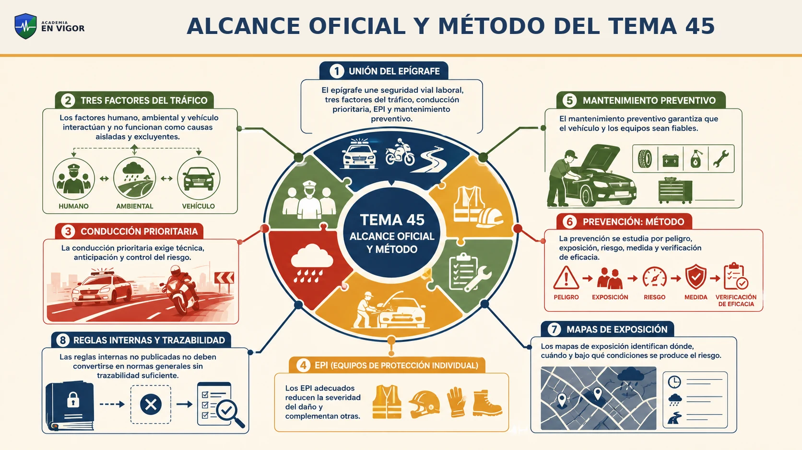

<em>Infografía: Alcance oficial y método del Tema 45.</em>

<!-- FUENTE: CONVOCATORIA-PN-2026-T45 -->

## 02. Ámbito preventivo en la actividad policial

**Idea de control:** El Real Decreto 2/2006 adapta la prevención a las peculiaridades de la actividad de la Policía Nacional.

- El Real Decreto 2/2006 adapta la prevención a las peculiaridades de la actividad de la Policía Nacional.
- Las funciones sin características exclusivas policiales reciben la normativa preventiva general con las peculiaridades aplicables.
- Las actividades exclusivas no quedan sin protección, sino sometidas a un régimen adaptado a sus particularidades.
- La conducción policial debe integrarse en el sistema preventivo aunque pueda presentar exigencias operativas especiales.

<!-- VISUAL:t45-02-ambito-preventivo-en-la-actividad-policial.webp -->

  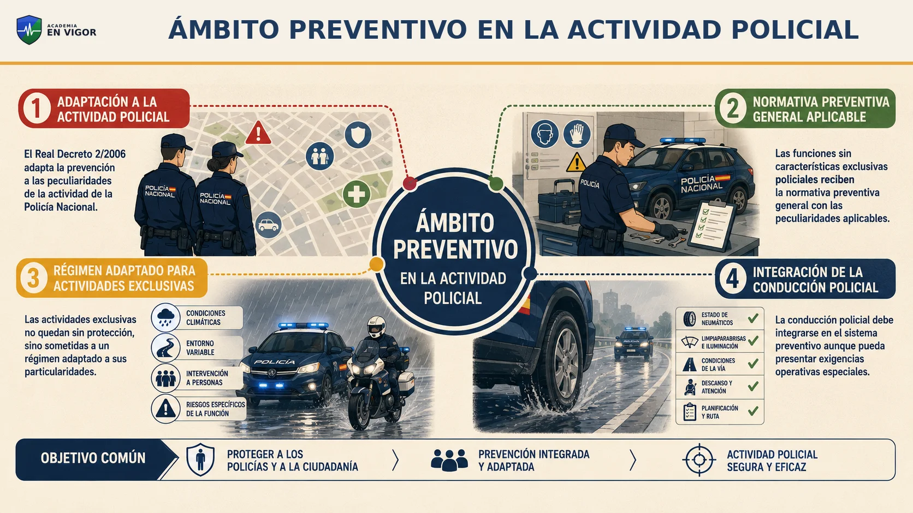

<em>Infografía: Ámbito preventivo en la actividad policial.</em>

<!-- FUENTE: BOE-RD2-2006-T45 -->

## 03. Integración de la prevención

**Idea de control:** La prevención se integra en el sistema general de gestión mediante un plan de prevención.

- La prevención se integra en el sistema general de gestión mediante un plan de prevención.
- La evaluación y la planificación son instrumentos esenciales de gestión preventiva.
- La evaluación inicial atiende a actividad, puestos y características de quienes los desempeñan.
- La conducción no se trata como un riesgo separado de la organización del servicio.

<!-- VISUAL:t45-03-integracion-de-la-prevencion.webp -->

  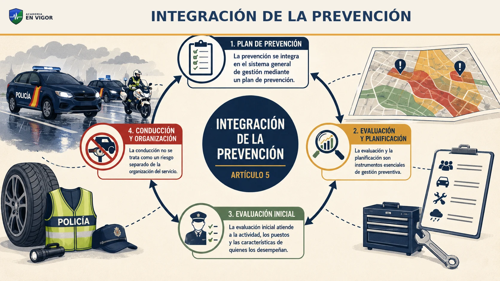

<em>Infografía: Integración de la prevención.</em>

<!-- FUENTE: BOE-RD2-2006-T45 -->

## 04. Principios de acción preventiva

**Idea de control:** La primera prioridad es evitar los riesgos cuando resulte posible.

- La primera prioridad es evitar los riesgos cuando resulte posible.
- Los riesgos que no puedan evitarse deben evaluarse.
- La acción preventiva combate el riesgo en su origen y adapta el trabajo a la persona.
- La protección colectiva se antepone a la individual dentro de la jerarquía preventiva.

<!-- VISUAL:t45-04-principios-de-accion-preventiva.webp -->

  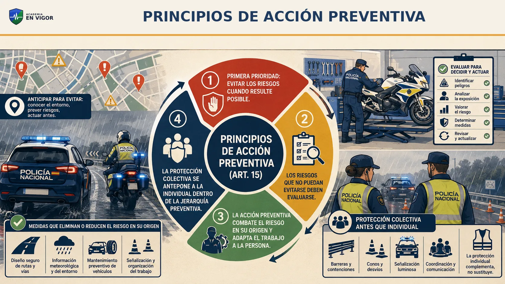

<em>Infografía: Principios de acción preventiva.</em>

<!-- FUENTE: BOE-LPRL-T45 -->

## 05. Peligro, riesgo y daño

**Idea de control:** El riesgo laboral es la posibilidad de sufrir un daño derivado del trabajo.

- El riesgo laboral es la posibilidad de sufrir un daño derivado del trabajo.
- La gravedad del riesgo valora conjuntamente probabilidad y severidad del daño.
- Un peligro es una fuente con capacidad de causar daño, mientras el riesgo incorpora exposición y condiciones.
- El daño puede ser lesión, enfermedad o patología sufrida con motivo u ocasión del trabajo.

<!-- VISUAL:t45-il-05-peligro-riesgo-y-dano.webp -->

  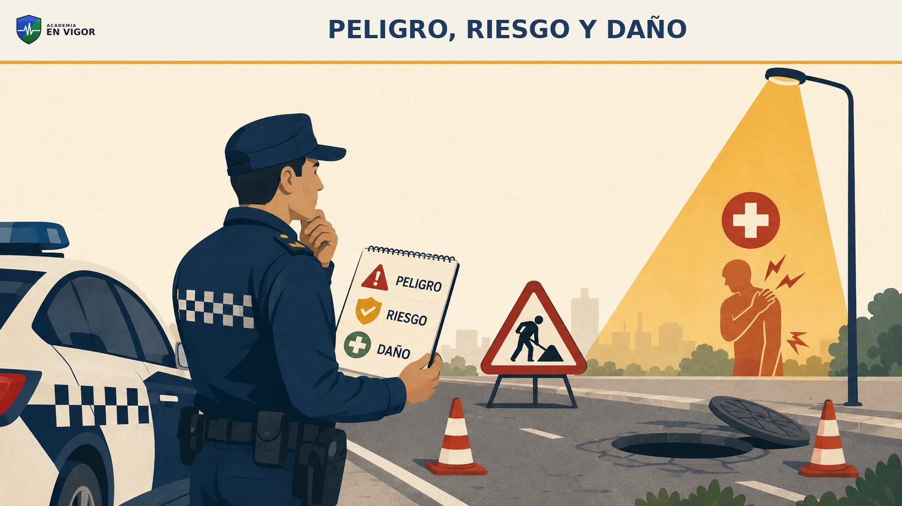

<em>Infografía: Peligro, riesgo y daño.</em>

<!-- FUENTE: BOE-LPRL-T45 -->

## 06. Información y formación

**Idea de control:** La información preventiva debe cubrir riesgos y medidas aplicables al puesto y a la actividad.

- La información preventiva debe cubrir riesgos y medidas aplicables al puesto y a la actividad.
- La formación debe ser teórica y práctica, suficiente y adecuada.
- La formación se adapta a cambios de funciones, tecnologías o equipos y se repite si es necesario.
- Una firma de recepción no demuestra por sí sola competencia práctica para conducción exigente.

<!-- VISUAL:t45-06-informacion-y-formacion.webp -->

  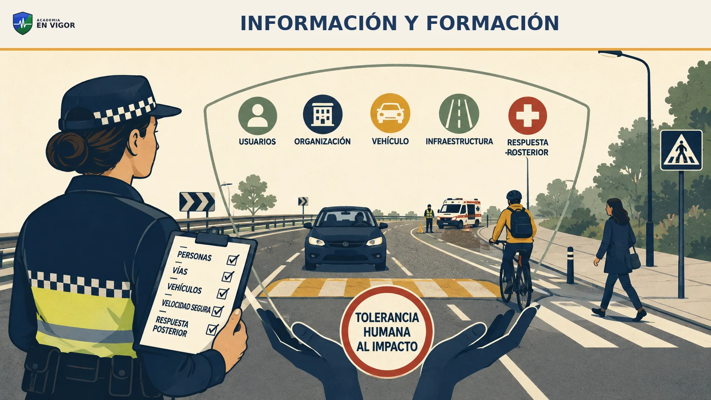

<em>Infografía: Información y formación.</em>

<!-- FUENTE: BOE-LPRL-T45 -->

## 07. Obligaciones de los funcionarios

**Idea de control:** Cada funcionario debe velar, según sus posibilidades, por su seguridad y la de quienes puedan verse afectados.

- Cada funcionario debe velar, según sus posibilidades, por su seguridad y la de quienes puedan verse afectados.
- Los equipos y medios se utilizan correctamente conforme a su formación e instrucciones.
- Los defectos o situaciones de riesgo se comunican de inmediato por el cauce establecido.
- La obligación individual no desplaza las responsabilidades organizativas de prevención.

<!-- VISUAL:t45-07-obligaciones-de-los-funcionarios.webp -->

  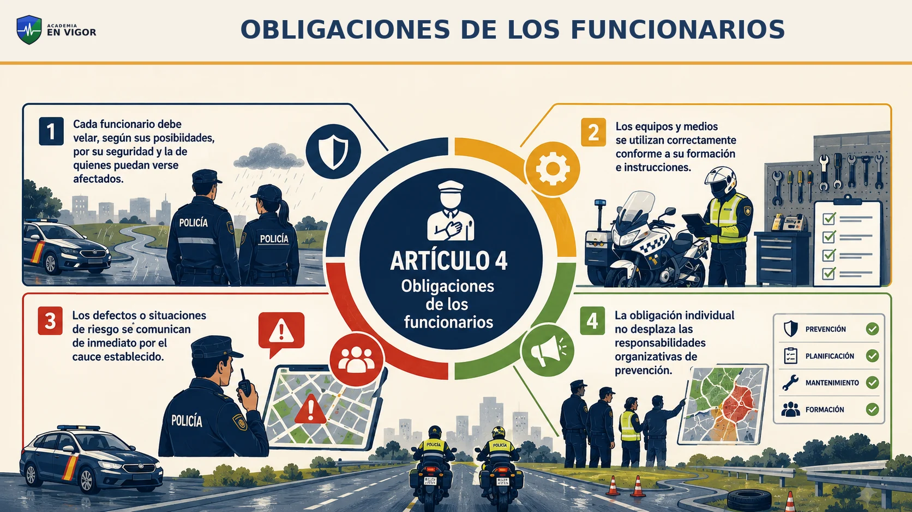

<em>Infografía: Obligaciones de los funcionarios.</em>

<!-- FUENTE: BOE-RD2-2006-T45 -->

## 08. Planificación de la actividad preventiva

**Idea de control:** La planificación define medidas, responsables, plazos y recursos cuando la evaluación revela riesgos.

- La planificación define medidas, responsables, plazos y recursos cuando la evaluación revela riesgos.
- Las medidas deben implantarse y comprobarse, no limitarse a figurar en un documento.
- Los resultados y daños obligan a revisar la adecuación de la actividad preventiva.
- La seguridad vial laboral exige indicadores de exposición y no solo recuentos absolutos de accidentes.

<!-- VISUAL:t45-08-planificacion-de-la-actividad-preventiva.webp -->

  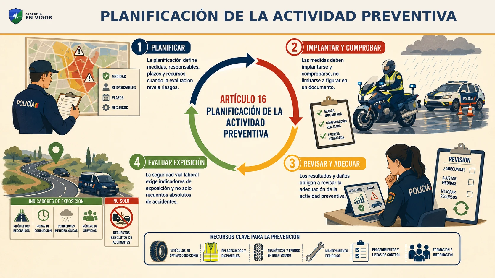

<em>Infografía: Planificación de la actividad preventiva.</em>

<!-- FUENTE: BOE-LPRL-T45 -->

## 09. Vigilancia de la salud y aptitud

**Idea de control:** La vigilancia de la salud se orienta a los riesgos inherentes a la actividad policial.

- La vigilancia de la salud se orienta a los riesgos inherentes a la actividad policial.
- La información sanitaria individual está sometida a confidencialidad.
- Las conclusiones preventivas sobre aptitud se separan del acceso indiscriminado a datos clínicos.
- Una limitación relevante para conducir debe gestionarse sin convertirla en diagnóstico público.

<!-- VISUAL:t45-09-vigilancia-de-la-salud-y-aptitud.webp -->

  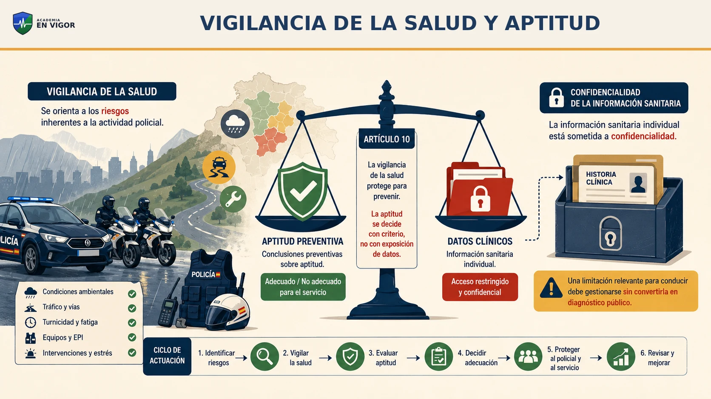

<em>Infografía: Vigilancia de la salud y aptitud.</em>

<!-- FUENTE: BOE-RD2-2006-T45 -->

## 10. Sistema Seguro y responsabilidad compartida

**Idea de control:** El Sistema Seguro asume que las personas cometen errores y que el sistema debe evitar consecuencias mortales o graves.

- El Sistema Seguro asume que las personas cometen errores y que el sistema debe evitar consecuencias mortales o graves.
- La responsabilidad se distribuye entre usuarios, organización, vehículo, infraestructura y respuesta posterior.
- La tolerancia humana al impacto limita la velocidad segura del sistema.
- La prevención eficaz combina capas porque ninguna medida aislada elimina todos los fallos.

<!-- VISUAL:t45-il-10-sistema-seguro-y-responsabilidad-compartida.webp -->

  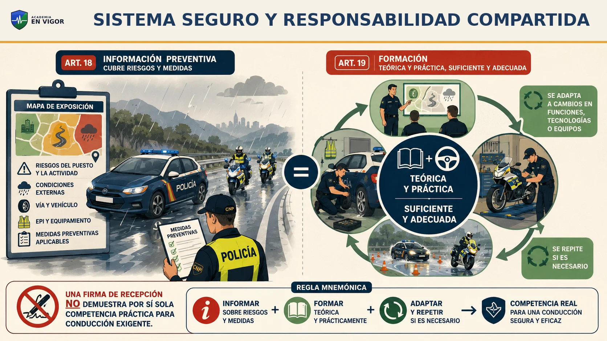

<em>Infografía: Sistema Seguro y responsabilidad compartida.</em>

<!-- FUENTE: DGT-ESV2030-T45 -->

## 11. Accidente de trabajo y lesión

**Idea de control:** El accidente de trabajo exige una lesión corporal sufrida con ocasión o por consecuencia del trabajo.

- El accidente de trabajo exige una lesión corporal sufrida con ocasión o por consecuencia del trabajo.
- Un daño exclusivamente material no basta para calificar por sí solo un accidente de trabajo.
- La relación con el trabajo debe analizarse y no presumirse solo porque intervenga un vehículo.
- La calificación de Seguridad Social y la investigación preventiva cumplen funciones distintas.

<!-- VISUAL:t45-11-accidente-de-trabajo-y-lesion.webp -->

  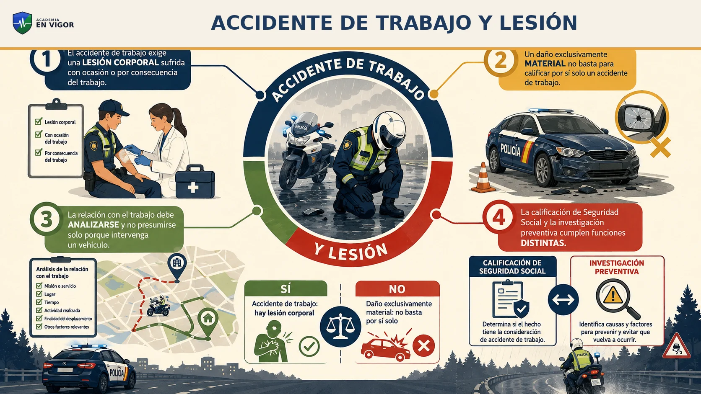

<em>Infografía: Accidente de trabajo y lesión.</em>

<!-- FUENTE: BOE-LGSS-T45 -->

## 12. Accidente in itinere

**Idea de control:** El accidente in itinere es el sufrido al ir al trabajo o volver de él.

- El accidente in itinere es el sufrido al ir al trabajo o volver de él.
- Su reconocimiento exige conexión suficiente entre desplazamiento y trabajo según las circunstancias del caso.
- Desvíos o interrupciones deben valorarse por su entidad y finalidad, no mediante una frase automática.
- In itinere no significa que todo el tiempo fuera del centro quede cubierto.

<!-- VISUAL:t45-12-accidente-in-itinere.webp -->

  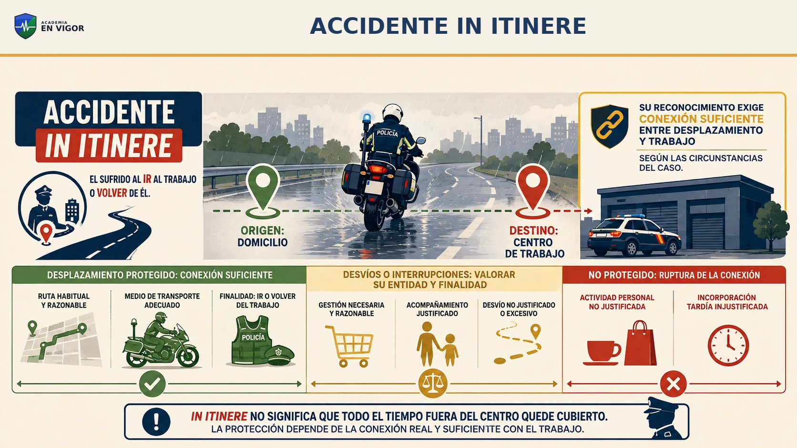

<em>Infografía: Accidente in itinere.</em>

<!-- FUENTE: BOE-LGSS-T45 -->

## 13. Accidente en misión

**Idea de control:** El accidente en misión se vincula a un desplazamiento exigido por la prestación laboral.

- El accidente en misión se vincula a un desplazamiento exigido por la prestación laboral.
- La misión puede incluir conducción y otras tareas realizadas en el lugar de destino.
- La conexión causal se analiza respecto de la actividad encomendada y sus circunstancias.
- No debe confundirse misión con el trayecto ordinario entre domicilio y centro de trabajo.

<!-- VISUAL:t45-13-accidente-en-mision.webp -->

  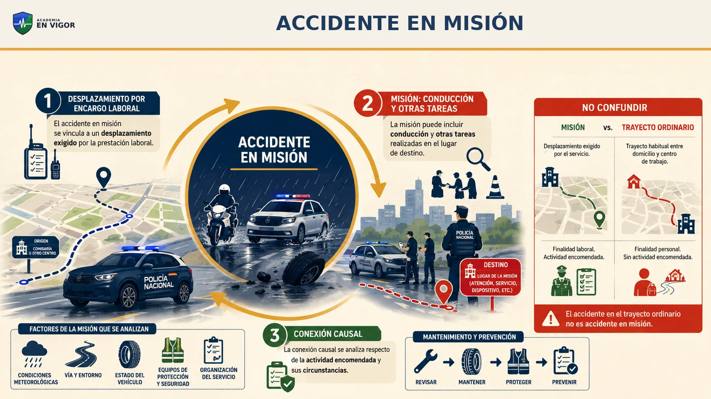

<em>Infografía: Accidente en misión.</em>

<!-- FUENTE: INSST-NTP1090-T45 -->

## 14. Exposición al riesgo vial

**Idea de control:** La exposición depende de kilómetros, tiempo, frecuencia, tipo de vía, horario y condiciones de circulación.

- La exposición depende de kilómetros, tiempo, frecuencia, tipo de vía, horario y condiciones de circulación.
- Dos unidades con igual número de accidentes pueden tener tasas distintas si su exposición difiere.
- La exposición incluye a conductores, pasajeros y personas que trabajan en la vía.
- Reducir desplazamientos innecesarios es una medida preventiva en origen.

<!-- VISUAL:t45-14-exposicion-al-riesgo-vial.webp -->

  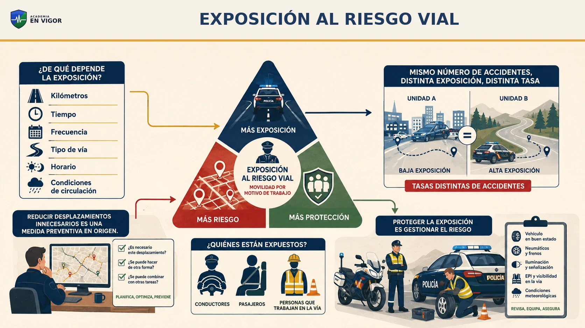

<em>Infografía: Exposición al riesgo vial.</em>

<!-- FUENTE: INSST-SVL-T45 -->

## 15. Frecuencia, incidencia y gravedad

**Idea de control:** La frecuencia informa cuántos sucesos aparecen en relación con una medida de exposición.

- La frecuencia informa cuántos sucesos aparecen en relación con una medida de exposición.
- La gravedad atiende a consecuencias y no se deduce del mero número de accidentes.
- Los porcentajes anuales describen una población y un periodo concretos.
- Una tendencia necesita series comparables y definiciones estables.

<!-- VISUAL:t45-il-15-frecuencia-incidencia-y-gravedad.webp -->

  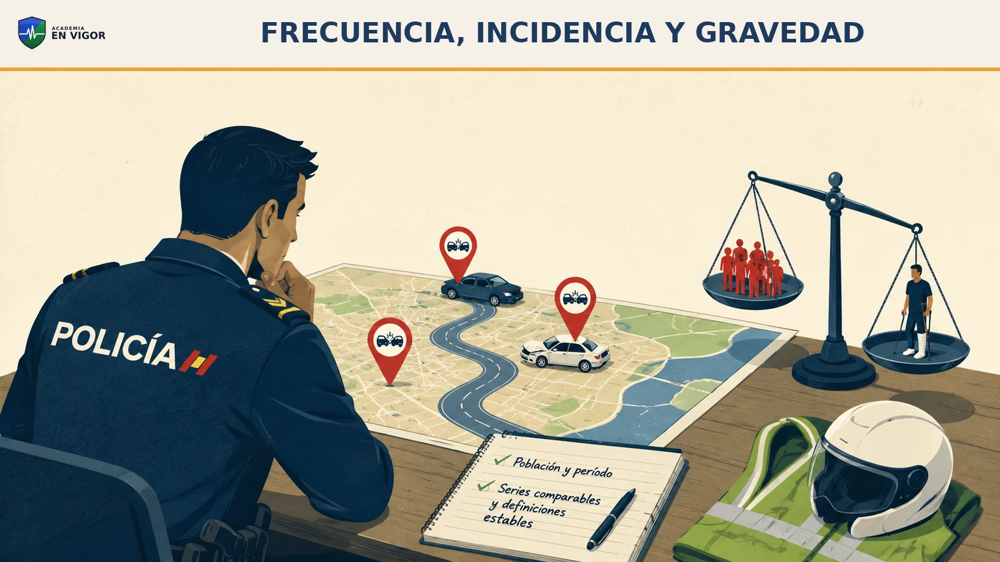

<em>Infografía: Frecuencia, incidencia y gravedad.</em>

<!-- FUENTE: INSST-ALT2024-T45 -->

## 16. Accidente con víctimas y clasificación

**Idea de control:** Las estadísticas deben leerse con la definición exacta de accidente y víctima utilizada.

- Las estadísticas deben leerse con la definición exacta de accidente y víctima utilizada.
- La gravedad estadística puede emplear criterios de hospitalización o fallecimiento en un periodo definido.
- Cambiar la definición rompe la comparación directa entre series.
- El dato administrativo no sustituye el análisis causal del siniestro.

<!-- VISUAL:t45-16-accidente-con-victimas-y-clasificacion.webp -->

  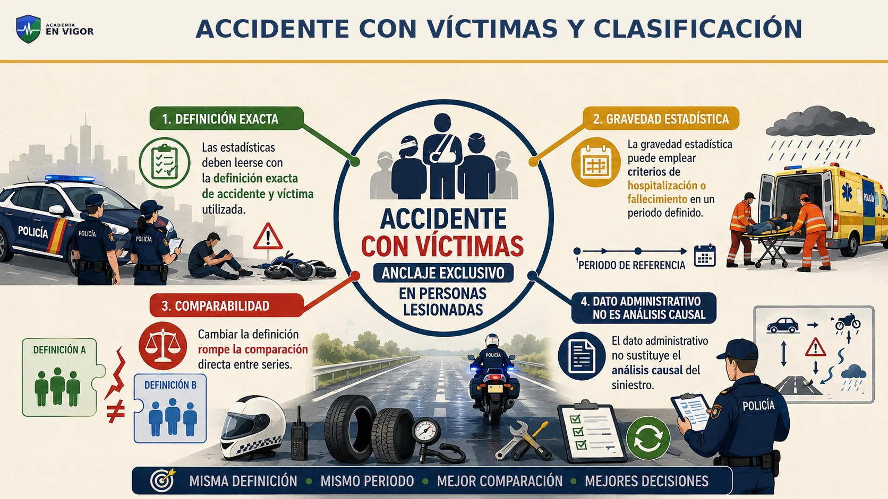

<em>Infografía: Accidente con víctimas y clasificación.</em>

<!-- FUENTE: INSST-ALT2024-T45 -->

## 17. Investigación preventiva del accidente

**Idea de control:** La aparición de daños obliga a investigar sus causas para detectar insuficiencias preventivas.

- La aparición de daños obliga a investigar sus causas para detectar insuficiencias preventivas.
- La investigación busca aprender y prevenir recurrencias, no repartir culpas como único objetivo.
- Debe recoger condiciones de persona, tarea, organización, vehículo y entorno.
- Las causas inmediatas y básicas se distinguen para no detenerse en el último error visible.

<!-- VISUAL:t45-17-investigacion-preventiva-del-accidente.webp -->

  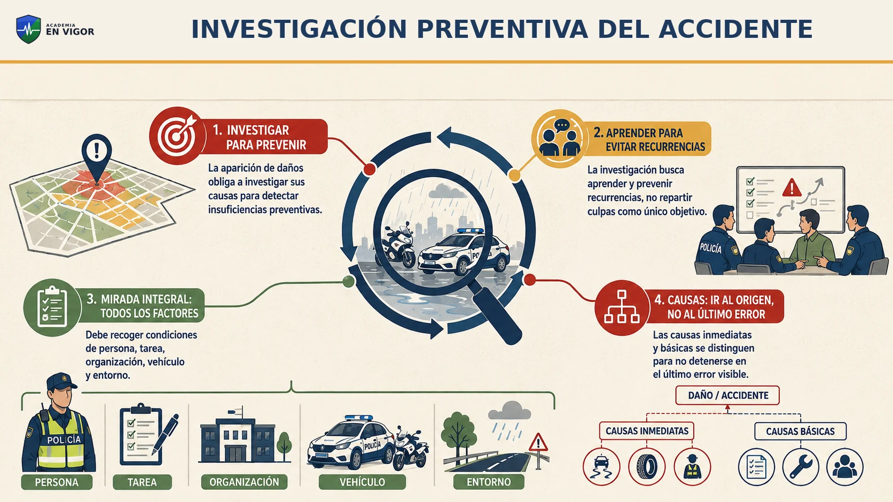

<em>Infografía: Investigación preventiva del accidente.</em>

<!-- FUENTE: BOE-LPRL-T45 -->

## 18. Modelo de Haddon

**Idea de control:** La matriz de Haddon cruza fases temporales con persona, vehículo y entorno.

- La matriz de Haddon cruza fases temporales con persona, vehículo y entorno.
- La fase previa busca evitar el siniestro.
- La fase del impacto procura limitar la transferencia de energía y las lesiones.
- La fase posterior mejora rescate, atención y recuperación.

<!-- VISUAL:t45-18-modelo-de-haddon.webp -->

  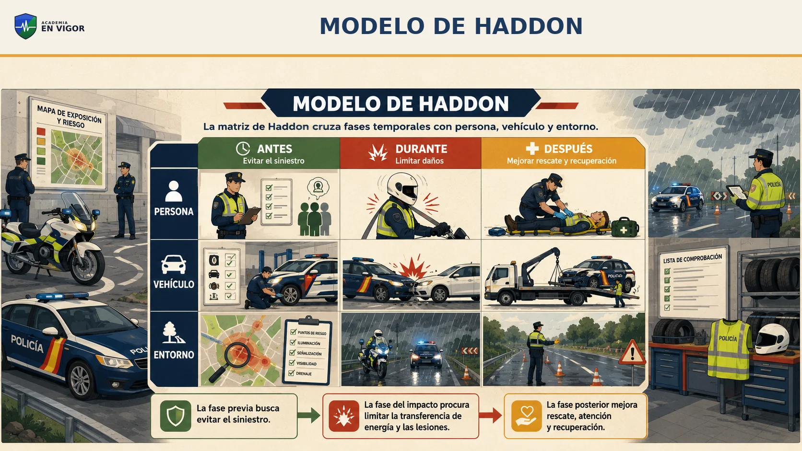

<em>Infografía: Modelo de Haddon.</em>

<!-- FUENTE: INSST-NTP1091-T45 -->

## 19. Plan de seguridad vial laboral

**Idea de control:** El plan parte de evaluación de riesgos y análisis de movilidad.

- El plan parte de evaluación de riesgos y análisis de movilidad.
- El diagnóstico identifica quién se desplaza, cómo, cuándo, por dónde y con qué exposición.
- Las medidas se priorizan por riesgo, eficacia y viabilidad sin reducirse a campañas genéricas.
- El seguimiento utiliza indicadores y revisión para corregir desviaciones.

<!-- VISUAL:t45-19-plan-de-seguridad-vial-laboral.webp -->

  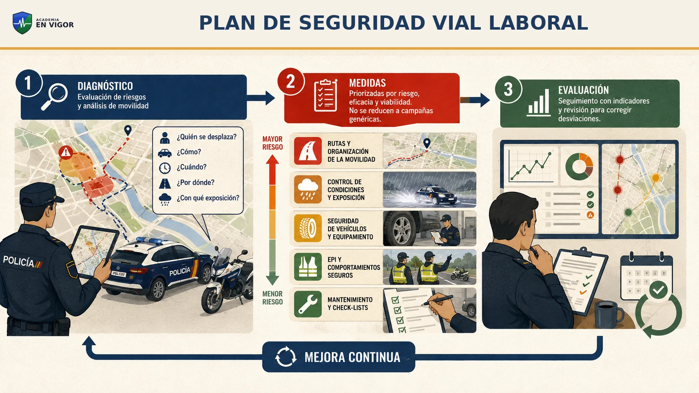

<em>Infografía: Plan de seguridad vial laboral.</em>

<!-- FUENTE: INSST-SVL-T45 -->

## 20. ISO 39001 en su sitio correcto

**Idea de control:** ISO 39001 se refiere a sistemas de gestión de la seguridad vial.

- ISO 39001 se refiere a sistemas de gestión de la seguridad vial.
- Una norma de gestión estructura objetivos, procesos y mejora, pero no reemplaza la legislación aplicable.
- La certificación no garantiza ausencia de siniestros.
- El examen debe diferenciar ISO 39001 de ISO 9001 e ISO 14001.

<!-- VISUAL:t45-il-20-iso-39001-en-su-sitio-correcto.webp -->

  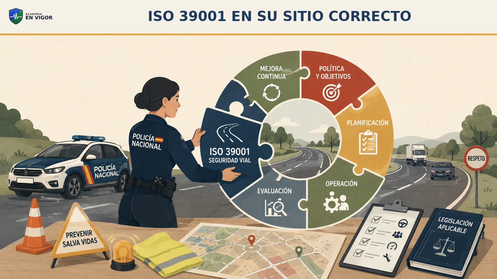

<em>Infografía: ISO 39001 en su sitio correcto.</em>

<!-- FUENTE: INSST-NTP1091-T45 -->

## 21. Factor humano sin monocausa

**Idea de control:** El factor humano incluye capacidades, estado, decisiones, experiencia y respuesta ante el entorno.

- El factor humano incluye capacidades, estado, decisiones, experiencia y respuesta ante el entorno.
- Que un error humano esté presente no demuestra que sea la única causa.
- Diseño, organización y tecnología deben tolerar errores previsibles.
- La explicación preventiva evita porcentajes universales atribuidos a la persona.

<!-- VISUAL:t45-21-factor-humano-sin-monocausa.webp -->

  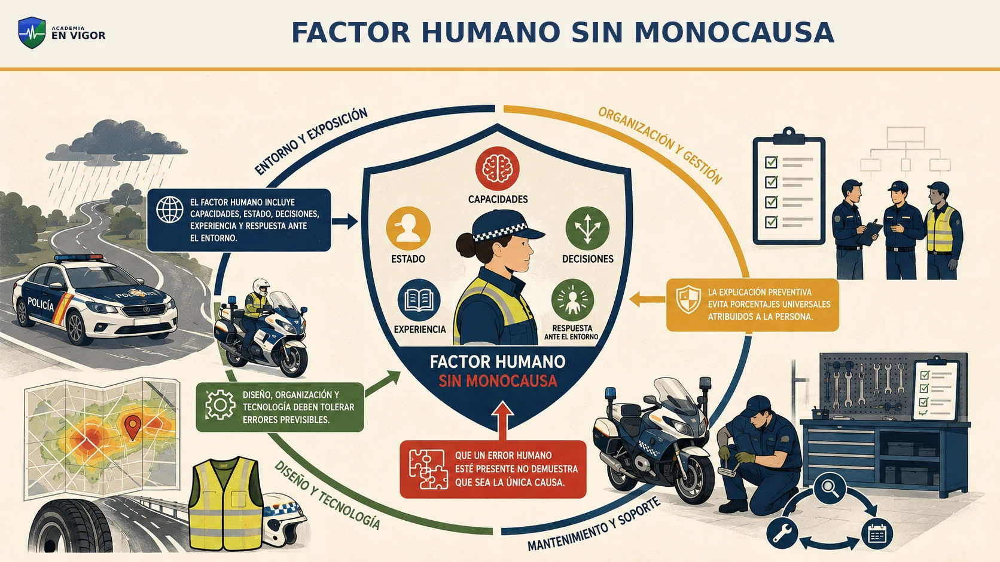

<em>Infografía: Factor humano sin monocausa.</em>

<!-- FUENTE: DGT-ESV2030-T45 -->

## 22. Percepción, decisión y ejecución

**Idea de control:** Conducir exige percibir información relevante, interpretarla, decidir y ejecutar.

- Conducir exige percibir información relevante, interpretarla, decidir y ejecutar.
- Un fallo puede aparecer en cualquiera de las fases de la cadena.
- La experiencia mejora patrones, pero también puede consolidar automatismos inseguros.
- La carga de trabajo excesiva reduce recursos para detectar cambios inesperados.

<!-- VISUAL:t45-22-percepcion-decision-y-ejecucion.webp -->

  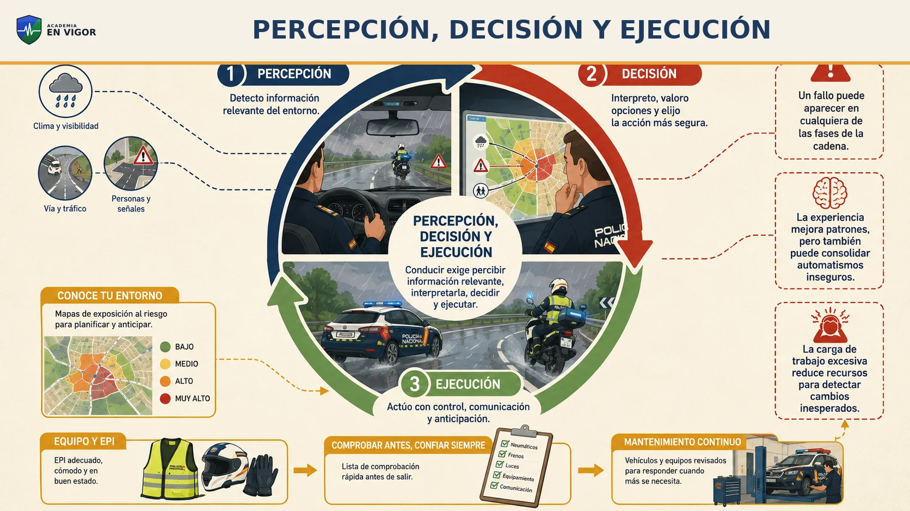

<em>Infografía: Percepción, decisión y ejecución.</em>

<!-- FUENTE: DGT-FACTOR-HUMANO-T45 -->

## 23. Atención y distracción

**Idea de control:** La distracción puede ser visual, manual, auditiva o cognitiva.

- La distracción puede ser visual, manual, auditiva o cognitiva.
- Una conversación puede detraer atención aunque las manos sigan en el volante.
- La radio y la navegación requieren gestión de tareas en el vehículo policial.
- La duración del desvío atencional se traduce en distancia recorrida sin supervisión suficiente.

<!-- VISUAL:t45-23-atencion-y-distraccion.webp -->

  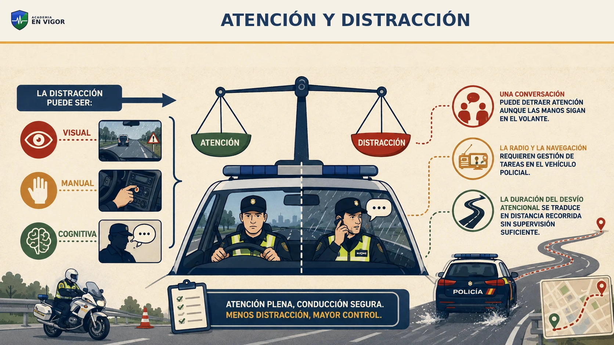

<em>Infografía: Atención y distracción.</em>

<!-- FUENTE: DGT-FACTOR-HUMANO-T45 -->

## 24. Fatiga y somnolencia

**Idea de control:** La fatiga reduce vigilancia, precisión y capacidad de respuesta.

- La fatiga reduce vigilancia, precisión y capacidad de respuesta.
- La somnolencia puede producir microsueños y pérdida de control.
- La monotonía, el trabajo nocturno y el descanso insuficiente elevan el riesgo.
- Abrir la ventanilla o subir la música no sustituye el descanso.

<!-- VISUAL:t45-24-fatiga-y-somnolencia.webp -->

  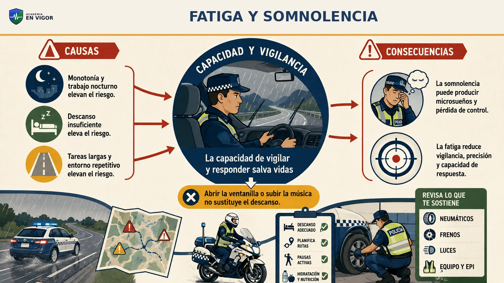

<em>Infografía: Fatiga y somnolencia.</em>

<!-- FUENTE: DGT-FACTOR-HUMANO-T45 -->

## 25. Ritmos circadianos y turnos

**Idea de control:** El rendimiento varía con el ritmo circadiano y el tiempo despierto.

- El rendimiento varía con el ritmo circadiano y el tiempo despierto.
- Los turnos nocturnos pueden coincidir con periodos de mayor propensión al sueño.
- La planificación debe considerar descansos, rotación y recuperación.
- La tolerancia individual no elimina el riesgo organizativo de horarios exigentes.

<!-- VISUAL:t45-il-25-ritmos-circadianos-y-turnos.webp -->

  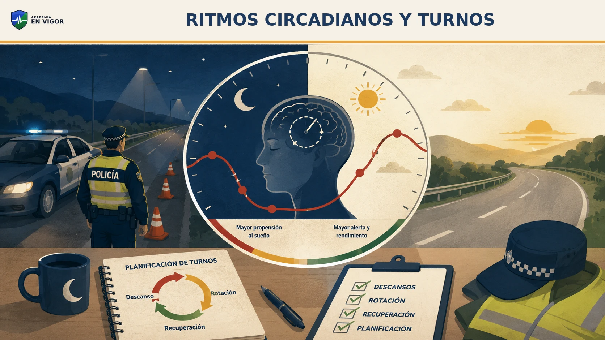

<em>Infografía: Ritmos circadianos y turnos.</em>

<!-- FUENTE: DGT-FACTOR-HUMANO-T45 -->

## 26. Alcohol y otras drogas

**Idea de control:** Alcohol y drogas pueden alterar percepción, coordinación, juicio y tiempo de respuesta.

- Alcohol y drogas pueden alterar percepción, coordinación, juicio y tiempo de respuesta.
- Cumplir una tasa administrativa no equivale a ausencia de deterioro preventivo.
- Los conductores de vehículos prioritarios están sujetos al régimen específico aplicable.
- La urgencia del servicio no autoriza consumo ni conducción bajo influencia.

<!-- VISUAL:t45-26-alcohol-y-otras-drogas.webp -->

  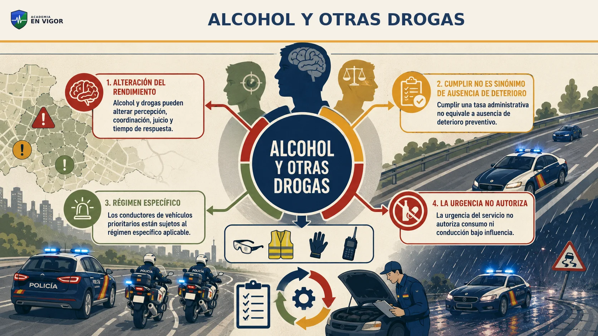

<em>Infografía: Alcohol y otras drogas.</em>

<!-- FUENTE: BOE-RGC-T45 -->

## 27. Medicamentos y salud

**Idea de control:** Algunos medicamentos producen somnolencia, visión alterada o menor coordinación.

- Algunos medicamentos producen somnolencia, visión alterada o menor coordinación.
- La combinación de fármacos o con alcohol puede modificar sus efectos.
- La persona debe atender indicaciones sanitarias y comunicar limitaciones por cauces protegidos.
- Un diagnóstico no permite deducir automáticamente idéntica incapacidad en todas las personas.

<!-- VISUAL:t45-27-medicamentos-y-salud.webp -->

  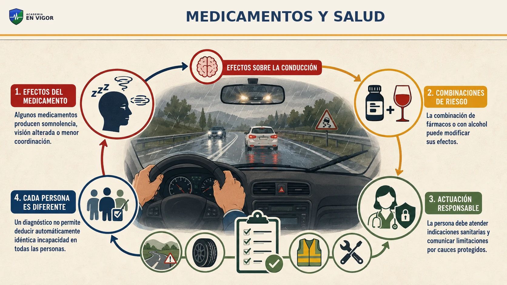

<em>Infografía: Medicamentos y salud.</em>

<!-- FUENTE: DGT-FACTOR-HUMANO-T45 -->

## 28. Estrés y activación

**Idea de control:** Una activación moderada puede favorecer respuesta, pero el exceso deteriora juicio y precisión.

- Una activación moderada puede favorecer respuesta, pero el exceso deteriora juicio y precisión.
- El estrés puede estrechar el campo atencional y favorecer decisiones impulsivas.
- La urgencia operativa exige técnicas que mantengan control y comunicación.
- Tras un evento crítico puede ser necesaria recuperación antes de seguir conduciendo.

<!-- VISUAL:t45-28-estres-y-activacion.webp -->

  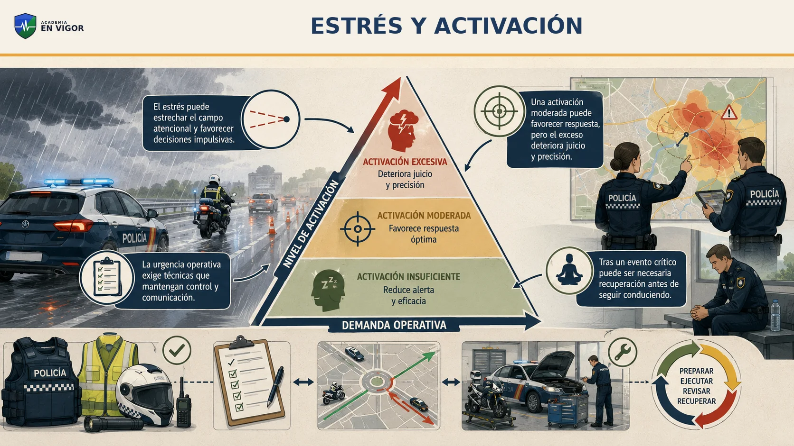

<em>Infografía: Estrés y activación.</em>

<!-- FUENTE: DGT-FACTOR-HUMANO-T45 -->

## 29. Velocidad elegida y riesgo

**Idea de control:** La velocidad condiciona tiempo disponible, distancia de detención y energía del impacto.

- La velocidad condiciona tiempo disponible, distancia de detención y energía del impacto.
- Una velocidad legal puede ser inadecuada para visibilidad, tráfico o firme.
- La presión por llegar no cambia los límites físicos.
- La gestión preventiva actúa también sobre objetivos y tiempos de servicio.

<!-- VISUAL:t45-29-velocidad-elegida-y-riesgo.webp -->

  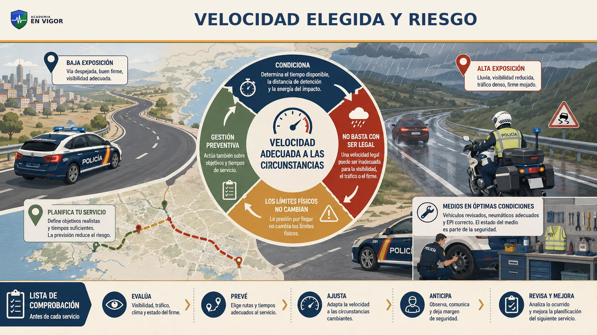

<em>Infografía: Velocidad elegida y riesgo.</em>

<!-- FUENTE: BOE-LSV-T45 -->

## 30. Cinturón, casco y conducta protectora

**Idea de control:** El uso correcto de retenciones y casco reduce consecuencias, pero no evita por sí solo el siniestro.

- El uso correcto de retenciones y casco reduce consecuencias, pero no evita por sí solo el siniestro.
- La exención jurídica y la recomendación preventiva responden a preguntas distintas.
- El ajuste incorrecto puede reducir protección o generar lesiones.
- La normalización del riesgo en trayectos rutinarios favorece omisiones de protección.

<!-- VISUAL:t45-il-30-cinturon-casco-y-conducta-protectora.webp -->

  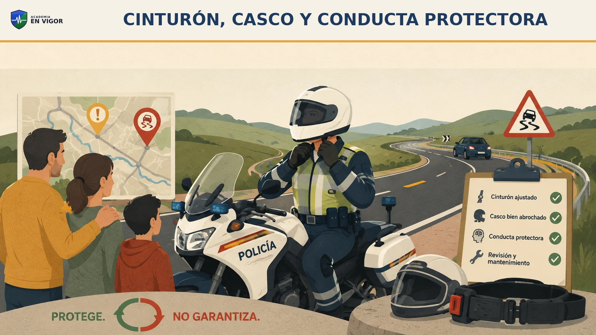

<em>Infografía: Cinturón, casco y conducta protectora.</em>

<!-- FUENTE: BOE-RGC-T45 -->

## 31. Factor ambiental amplio

**Idea de control:** El factor ambiental incluye infraestructura, tráfico, visibilidad, meteorología y entorno de trabajo.

- El factor ambiental incluye infraestructura, tráfico, visibilidad, meteorología y entorno de trabajo.
- Una misma vía cambia de riesgo según hora, densidad y condiciones.
- El entorno puede combinar peligros y reducir simultáneamente percepción y adherencia.
- La evaluación debe describir escenarios, no limitarse al nombre de la carretera.

<!-- VISUAL:t45-31-factor-ambiental-amplio.webp -->

  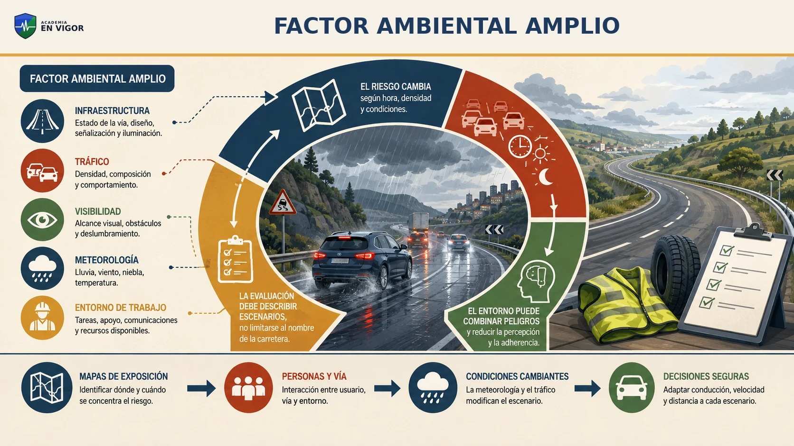

<em>Infografía: Factor ambiental amplio.</em>

<!-- FUENTE: INSST-NTP1090-T45 -->

## 32. Lluvia y adherencia

**Idea de control:** La lluvia reduce adherencia y visibilidad y puede aumentar distancia de frenado.

- La lluvia reduce adherencia y visibilidad y puede aumentar distancia de frenado.
- El inicio de la lluvia puede mezclar agua y residuos de la calzada.
- El aquaplaning depende de agua, velocidad, neumático y carga, no de una cifra única.
- La respuesta preventiva prioriza suavidad, distancia y velocidad adaptada.

<!-- VISUAL:t45-32-lluvia-y-adherencia.webp -->

  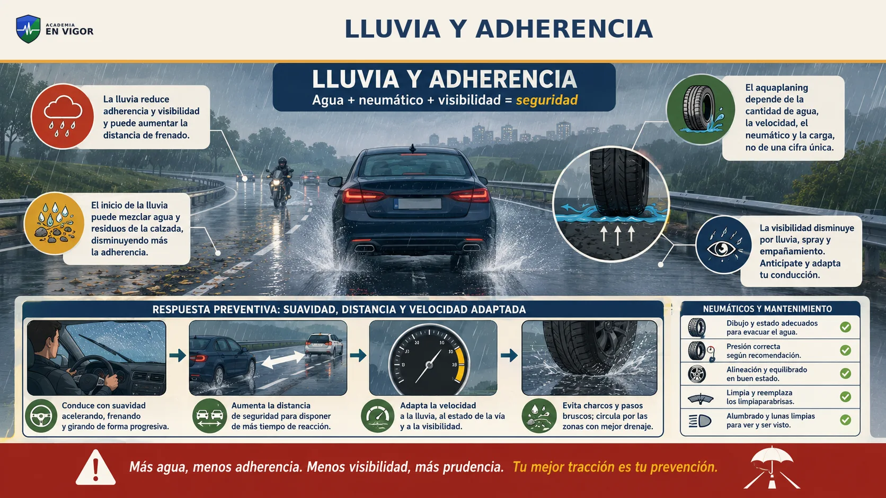

<em>Infografía: Lluvia y adherencia.</em>

<!-- FUENTE: DGT-ESV2030-T45 -->

## 33. Niebla y campo visual

**Idea de control:** La niebla reduce alcance visual y contraste.

- La niebla reduce alcance visual y contraste.
- La velocidad debe permitir detenerse dentro de la zona realmente visible.
- La luz inadecuada puede reflejarse y empeorar la visión.
- Seguir de cerca una luz ajena crea dependencia y reduce margen de reacción.

<!-- VISUAL:t45-33-niebla-y-campo-visual.webp -->

  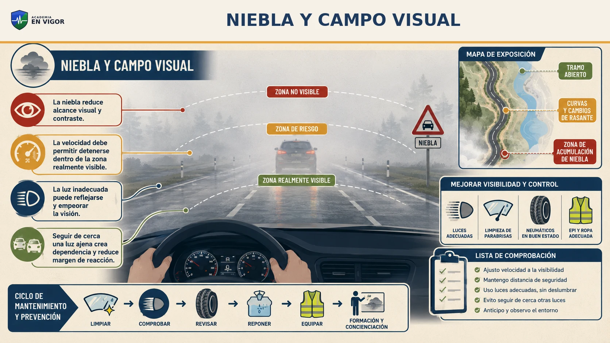

<em>Infografía: Niebla y campo visual.</em>

<!-- FUENTE: DGT-ESV2030-T45 -->

## 34. Nieve, hielo y baja fricción

**Idea de control:** Nieve y hielo pueden reducir drásticamente la adherencia disponible.

- Nieve y hielo pueden reducir drásticamente la adherencia disponible.
- Puentes, umbrías y zonas húmedas pueden helarse antes que otros tramos.
- Las órdenes de aceleración, frenado y dirección deben ser progresivas.
- Los sistemas electrónicos asisten, pero no sustituyen el agarre físico.

<!-- VISUAL:t45-34-nieve-hielo-y-baja-friccion.webp -->

  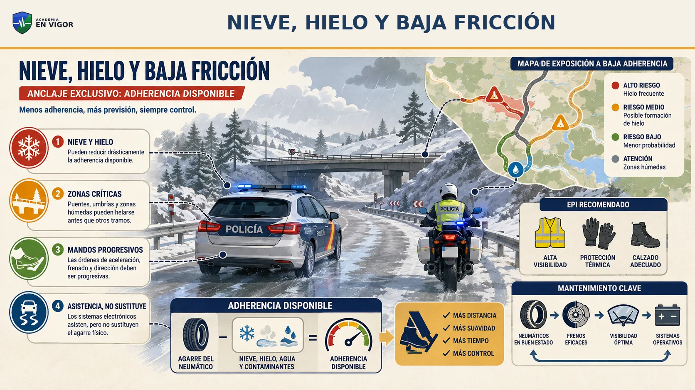

<em>Infografía: Nieve, hielo y baja fricción.</em>

<!-- FUENTE: DGT-ESV2030-T45 -->

## 35. Viento lateral

**Idea de control:** El viento lateral puede desviar la trayectoria y afectar más a vehículos de gran superficie.

- El viento lateral puede desviar la trayectoria y afectar más a vehículos de gran superficie.
- La salida de un túnel o el adelantamiento a un vehículo voluminoso cambia bruscamente la exposición.
- La corrección debe ser anticipada y progresiva.
- Reducir velocidad aumenta margen frente a ráfagas imprevisibles.

<!-- VISUAL:t45-il-35-viento-lateral.webp -->

  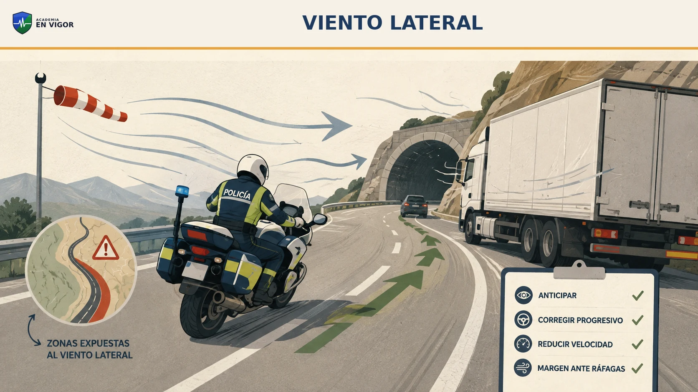

<em>Infografía: Viento lateral.</em>

<!-- FUENTE: DGT-ESV2030-T45 -->

## 36. Iluminación y conducción nocturna

**Idea de control:** De noche disminuyen referencias visuales y contraste.

- De noche disminuyen referencias visuales y contraste.
- La velocidad debe guardar relación con la distancia iluminada y la posibilidad de detenerse.
- El deslumbramiento obliga a reducir demanda visual y evitar fijar la fuente luminosa.
- La limpieza de parabrisas y ópticas condiciona visibilidad real.

<!-- VISUAL:t45-36-iluminacion-y-conduccion-nocturna.webp -->

  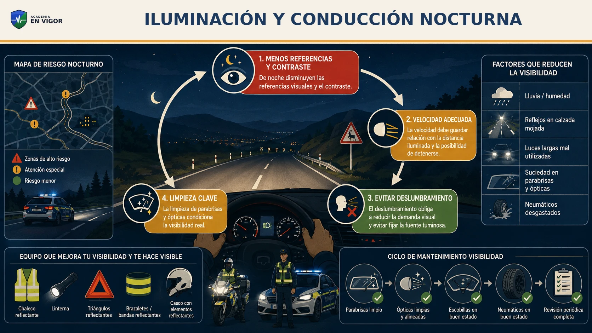

<em>Infografía: Iluminación y conducción nocturna.</em>

<!-- FUENTE: BOE-RGC-T45 -->

## 37. Diseño de la vía

**Idea de control:** Curvas, pendientes, intersecciones y accesos modifican visibilidad y trayectorias de conflicto.

- Curvas, pendientes, intersecciones y accesos modifican visibilidad y trayectorias de conflicto.
- Los márgenes perdonadores pueden reducir consecuencias de una salida de vía.
- La señalización debe interpretarse junto con geometría y tráfico real.
- Un punto negro estadístico no reemplaza la observación del escenario inmediato.

<!-- VISUAL:t45-37-diseno-de-la-via.webp -->

  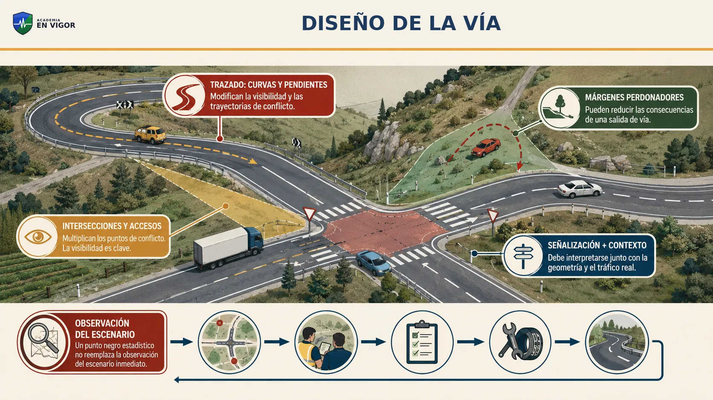

<em>Infografía: Diseño de la vía.</em>

<!-- FUENTE: DGT-ESV2030-T45 -->

## 38. Estado del firme y obstáculos

**Idea de control:** Baches, gravilla, vertidos y obras pueden alterar adherencia y trayectoria.

- Baches, gravilla, vertidos y obras pueden alterar adherencia y trayectoria.
- Un obstáculo pequeño para un turismo puede ser crítico para una motocicleta.
- La información previa de la ruta ayuda, pero no garantiza que el estado permanezca igual.
- La tripulación debe comunicar riesgos observados para proteger a otras unidades.

<!-- VISUAL:t45-38-estado-del-firme-y-obstaculos.webp -->

  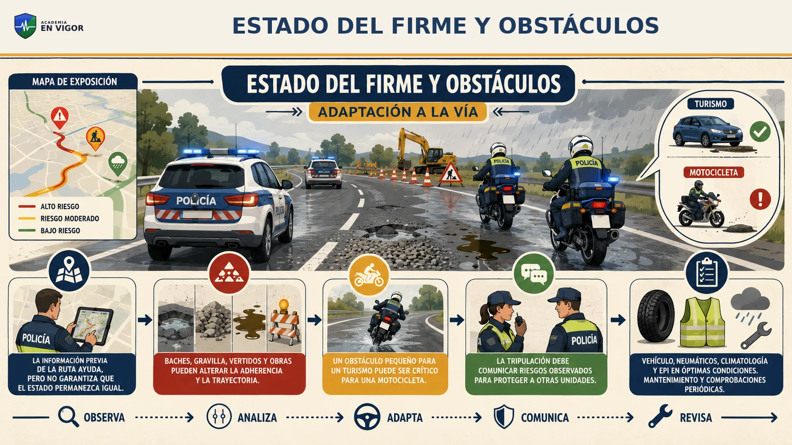

<em>Infografía: Estado del firme y obstáculos.</em>

<!-- FUENTE: BOE-LSV-T45 -->

## 39. Densidad y composición del tráfico

**Idea de control:** La densidad aumenta interacciones y reduce espacios de maniobra.

- La densidad aumenta interacciones y reduce espacios de maniobra.
- Peatones, ciclistas y motoristas presentan perfiles de percepción y vulnerabilidad diferentes.
- Las reacciones a una sirena pueden ser tardías, bruscas o contradictorias.
- El conductor prioritario debe planificar vías de escape y no asumir que todos cederán igual.

<!-- VISUAL:t45-39-densidad-y-composicion-del-trafico.webp -->

  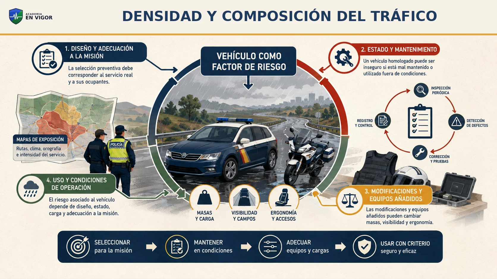

<em>Infografía: Densidad y composición del tráfico.</em>

<!-- FUENTE: INSST-NTP1090-T45 -->

## 40. Planificación de rutas y contingencias

**Idea de control:** La planificación valora seguridad, tiempo, tráfico, meteorología y disponibilidad de alternativas.

- La planificación valora seguridad, tiempo, tráfico, meteorología y disponibilidad de alternativas.
- La ruta más corta no es necesariamente la de menor riesgo.
- Los cambios sobrevenidos exigen reevaluar y no obedecer ciegamente al navegador.
- Una alternativa preparada reduce decisiones improvisadas bajo presión.

<!-- VISUAL:t45-il-40-planificacion-de-rutas-y-contingencias.webp -->

  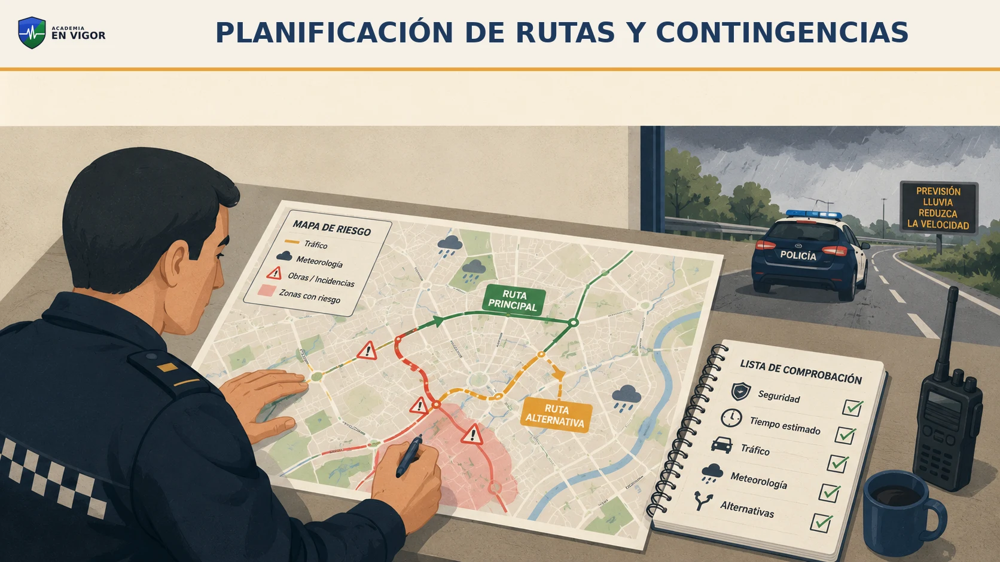

<em>Infografía: Planificación de rutas y contingencias.</em>

<!-- FUENTE: INSST-SVL-T45 -->

## 41. Vehículo como factor de riesgo

**Idea de control:** El riesgo asociado al vehículo depende de diseño, estado, carga y adecuación a la misión.

- El riesgo asociado al vehículo depende de diseño, estado, carga y adecuación a la misión.
- Un vehículo homologado puede ser inseguro si está mal mantenido o utilizado fuera de condiciones.
- Las modificaciones y equipos añadidos pueden cambiar masas, visibilidad y ergonomía.
- La selección preventiva debe corresponder al servicio real y a sus ocupantes.

<!-- VISUAL:t45-41-vehiculo-como-factor-de-riesgo.webp -->

  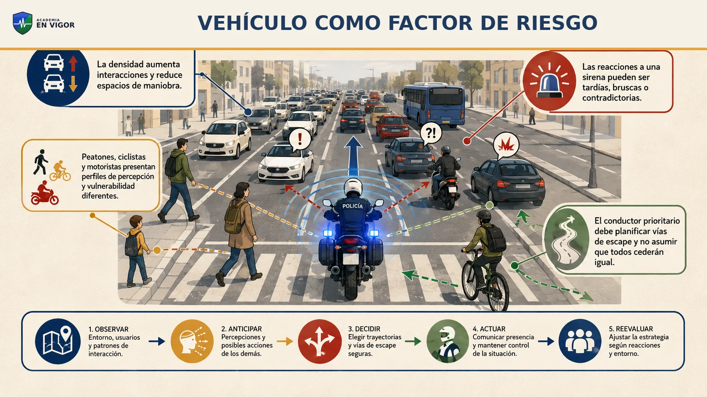

<em>Infografía: Vehículo como factor de riesgo.</em>

<!-- FUENTE: INSST-NTP1090-T45 -->

## 42. Neumáticos

**Idea de control:** El neumático es el contacto entre vehículo y calzada.

- El neumático es el contacto entre vehículo y calzada.
- Presión, desgaste, daños y carga influyen en adherencia y estabilidad.
- La presión se comprueba con referencia del fabricante y condiciones adecuadas.
- La profundidad legal mínima no equivale a rendimiento óptimo en toda circunstancia.

<!-- VISUAL:t45-42-neumaticos.webp -->

  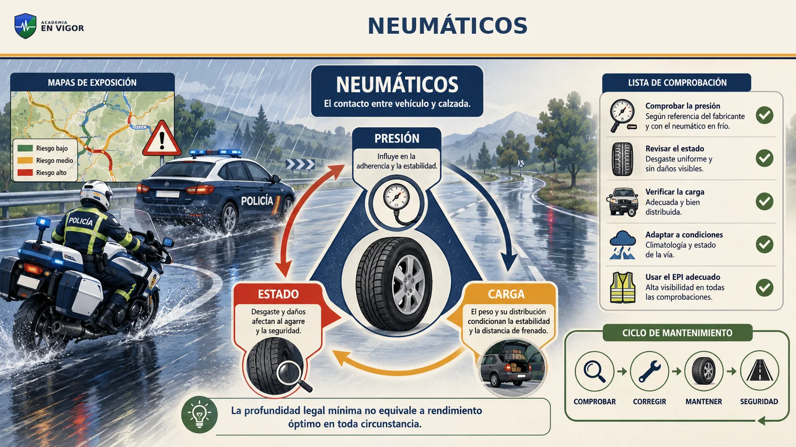

<em>Infografía: Neumáticos.</em>

<!-- FUENTE: BOE-RGV-T45 -->

## 43. Frenos

**Idea de control:** La frenada segura requiere eficacia, equilibrio y respuesta previsible.

- La frenada segura requiere eficacia, equilibrio y respuesta previsible.
- Vibraciones, desviaciones o testigos pueden revelar una anomalía que debe evaluarse.
- El calentamiento puede degradar prestaciones si se exige repetidamente al sistema.
- ABS ayuda a conservar capacidad direccional, pero no elimina la distancia física necesaria.

<!-- VISUAL:t45-43-frenos.webp -->

  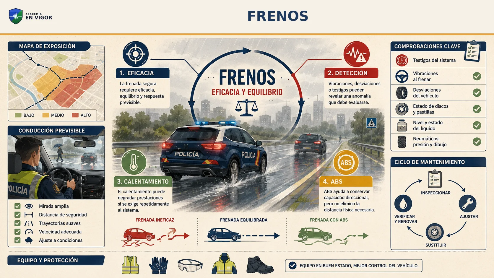

<em>Infografía: Frenos.</em>

<!-- FUENTE: BOE-ITV-T45 -->

## 44. Dirección y suspensión

**Idea de control:** Dirección y suspensión mantienen control, contacto y geometría previstos.

- Dirección y suspensión mantienen control, contacto y geometría previstos.
- Holguras o amortiguación deficiente pueden alterar estabilidad y frenada.
- Una modificación de altura o carga afecta comportamiento dinámico.
- La inspección cotidiana detecta síntomas, pero no sustituye diagnóstico técnico.

<!-- VISUAL:t45-44-direccion-y-suspension.webp -->

  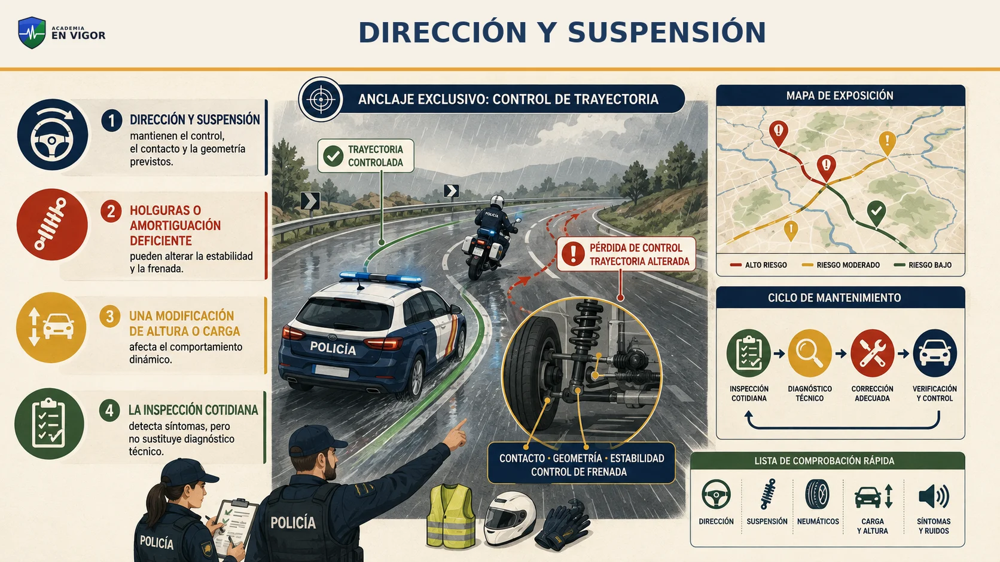

<em>Infografía: Dirección y suspensión.</em>

<!-- FUENTE: BOE-ITV-T45 -->

## 45. Alumbrado, señalización y visibilidad

**Idea de control:** Alumbrado y señalización permiten ver, ser visto y comunicar maniobras.

- Alumbrado y señalización permiten ver, ser visto y comunicar maniobras.
- Suciedad, mala regulación o fallo parcial reducen alcance y pueden deslumbrar.
- Limpiaparabrisas, lavaparabrisas y desempañado sostienen el campo visual.
- La señal prioritaria no compensa una iluminación ordinaria defectuosa.

<!-- VISUAL:t45-il-45-alumbrado-senalizacion-y-visibilidad.webp -->

  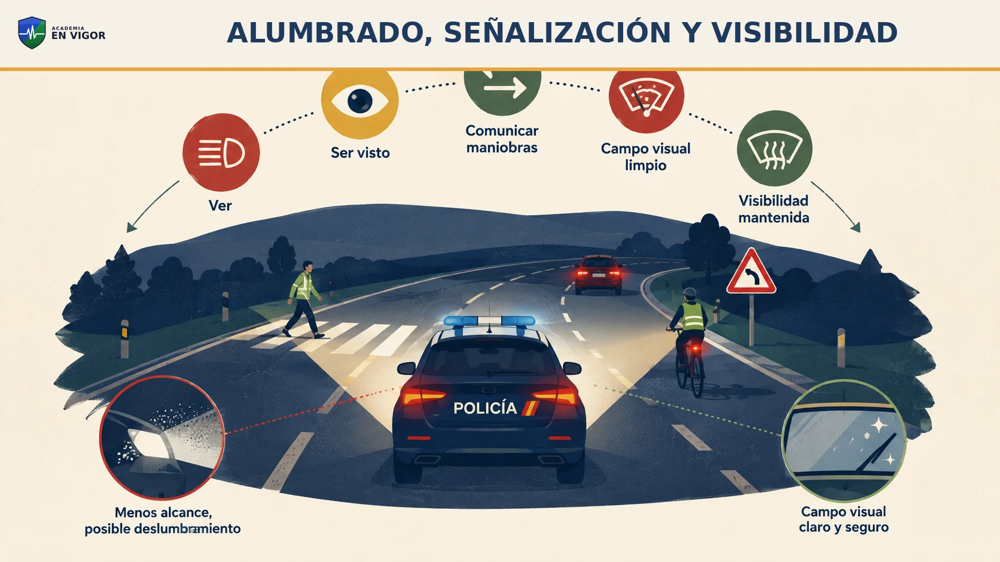

<em>Infografía: Alumbrado, señalización y visibilidad.</em>

<!-- FUENTE: BOE-RGV-T45 -->

## 46. Ergonomía y posición

**Idea de control:** Asiento, volante, pedales, espejos y reposacabezas se ajustan antes de iniciar la marcha.

- Asiento, volante, pedales, espejos y reposacabezas se ajustan antes de iniciar la marcha.
- La postura debe permitir control completo sin alcance forzado.
- El equipo policial puede modificar movilidad, apoyo y geometría del cinturón.
- La alternancia y las pausas ayudan frente a carga postural prolongada.

<!-- VISUAL:t45-46-ergonomia-y-posicion.webp -->

  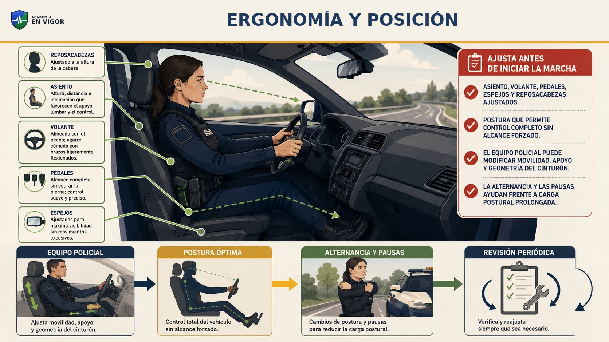

<em>Infografía: Ergonomía y posición.</em>

<!-- FUENTE: INSST-SVL-T45 -->

## 47. Carga y material de dotación

**Idea de control:** El material suelto puede convertirse en proyectil durante frenada o impacto.

- El material suelto puede convertirse en proyectil durante frenada o impacto.
- La distribución de carga modifica centro de gravedad y respuesta del vehículo.
- La carga no debe obstruir visibilidad, mandos, ventilación ni salidas.
- El anclaje debe ser adecuado a masa y fuerzas previsibles.

<!-- VISUAL:t45-47-carga-y-material-de-dotacion.webp -->

  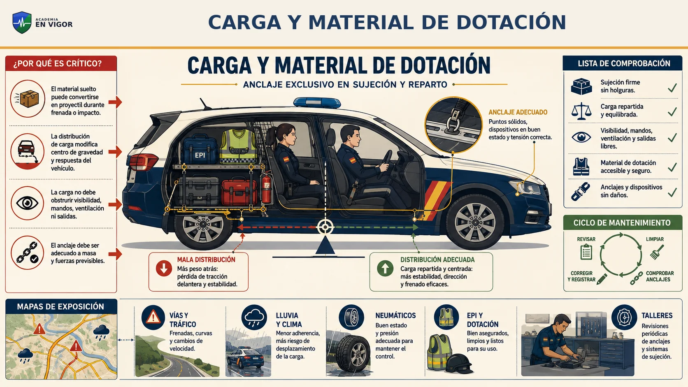

<em>Infografía: Carga y material de dotación.</em>

<!-- FUENTE: BOE-LSV-T45 -->

## 48. Sistemas activos, pasivos y terciarios

**Idea de control:** La seguridad activa intenta evitar o mitigar el siniestro antes del impacto.

- La seguridad activa intenta evitar o mitigar el siniestro antes del impacto.
- La seguridad pasiva limita lesiones durante la colisión.
- La seguridad terciaria facilita aviso, rescate y asistencia posterior.
- Las tres capas son complementarias y dependen de uso y mantenimiento.

<!-- VISUAL:t45-48-sistemas-activos-pasivos-y-terciarios.webp -->

  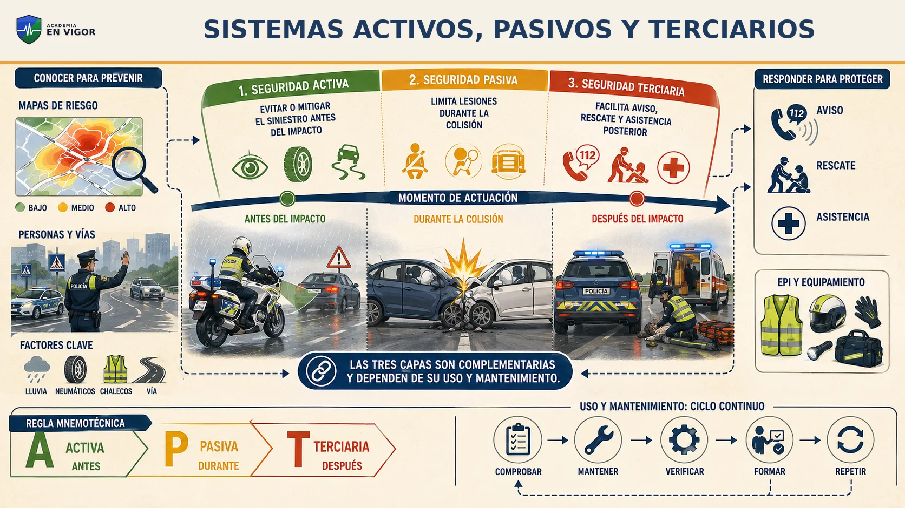

<em>Infografía: Sistemas activos, pasivos y terciarios.</em>

<!-- FUENTE: DGT-ESV2030-T45 -->

## 49. Inspección técnica y mantenimiento

**Idea de control:** La ITV verifica requisitos definidos en un momento concreto.

- La ITV verifica requisitos definidos en un momento concreto.
- Una ITV favorable no impide que aparezca después una avería.
- Los defectos graves o peligrosos tienen consecuencias distintas según su clasificación normativa.
- El mantenimiento preventivo complementa, pero no sustituye, la inspección obligatoria.

<!-- VISUAL:t45-49-inspeccion-tecnica-y-mantenimiento.webp -->

  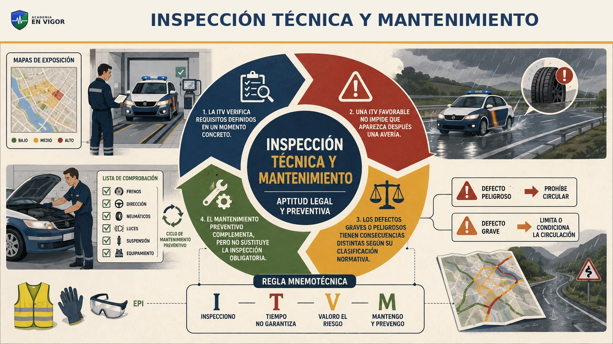

<em>Infografía: Inspección técnica y mantenimiento.</em>

<!-- FUENTE: BOE-ITV-T45 -->

## 50. Alertas, testigos y degradación

**Idea de control:** Un testigo informa de un estado que debe interpretarse conforme al manual y la gravedad.

- Un testigo informa de un estado que debe interpretarse conforme al manual y la gravedad.
- Ignorar una alerta puede convertir un defecto controlable en fallo crítico.
- El modo degradado limita funciones y no debe confundirse con operación normal.
- La ausencia de testigo no reemplaza comprobaciones físicas y percepción de síntomas.

<!-- VISUAL:t45-il-50-alertas-testigos-y-degradacion.webp -->

  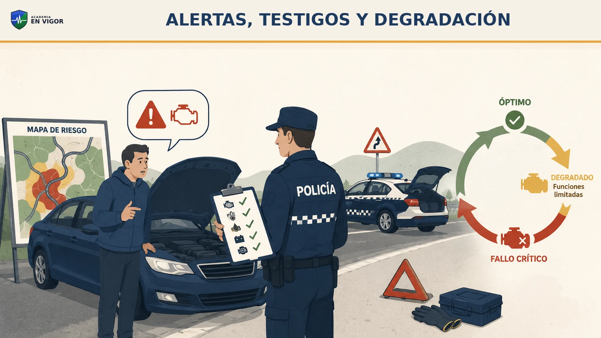

<em>Infografía: Alertas, testigos y degradación.</em>

<!-- FUENTE: BOE-RGV-T45 -->

## 51. Riesgo específico de la urgencia

**Idea de control:** La urgencia combina presión temporal, mayor carga mental y escenarios dinámicos.

- La urgencia combina presión temporal, mayor carga mental y escenarios dinámicos.
- El régimen prioritario concede facultades, pero no modifica límites físicos.
- La señalización especial advierte presencia y no garantiza haber sido percibida.
- La decisión operativa debe equilibrar necesidad, probabilidad y consecuencias.

<!-- VISUAL:t45-51-riesgo-especifico-de-la-urgencia.webp -->

  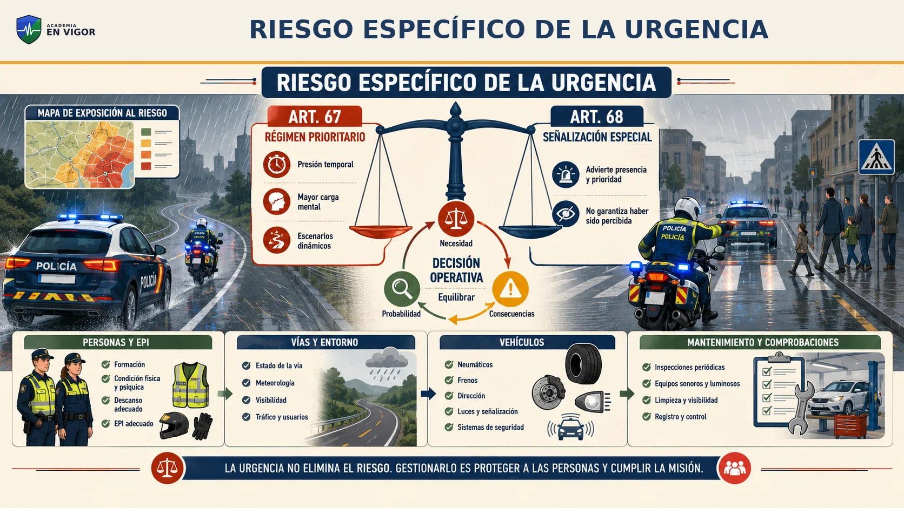

<em>Infografía: Riesgo específico de la urgencia.</em>

<!-- FUENTE: BOE-RGC-T45 -->

## 52. Facultades y responsabilidad

**Idea de control:** El conductor prioritario actúa bajo su exclusiva responsabilidad al aplicar determinadas excepciones.

- El conductor prioritario actúa bajo su exclusiva responsabilidad al aplicar determinadas excepciones.
- Debe cerciorarse de no poner en peligro a ningún usuario.
- Las órdenes y señales de los agentes conservan obligatoriedad.
- La prioridad no equivale a inmunidad disciplinaria, administrativa, civil o penal.

<!-- VISUAL:t45-52-facultades-y-responsabilidad.webp -->

  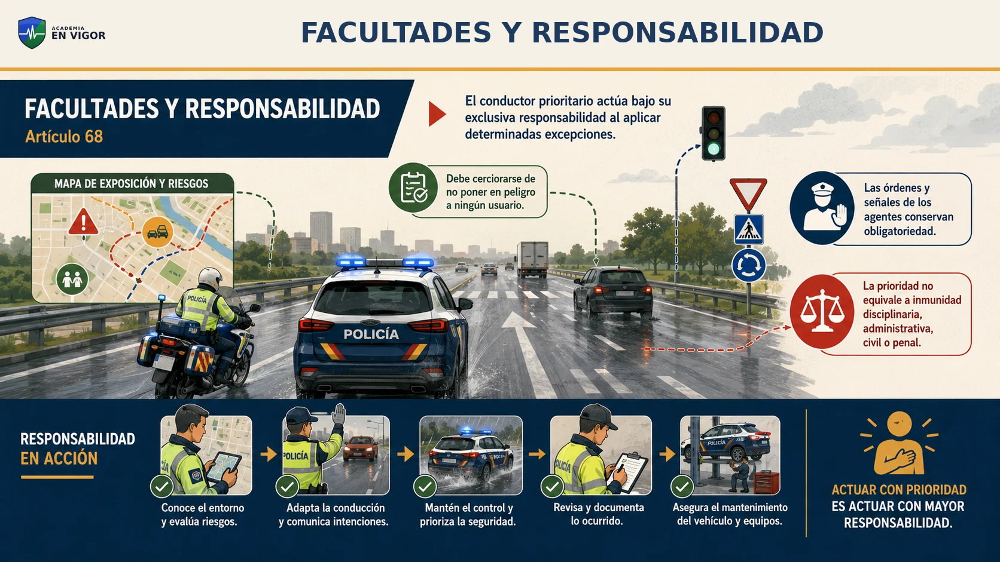

<em>Infografía: Facultades y responsabilidad.</em>

<!-- FUENTE: BOE-RGC-T45 -->

## 53. Intersecciones

**Idea de control:** Las intersecciones concentran trayectorias conflictivas y zonas ocultas.

- Las intersecciones concentran trayectorias conflictivas y zonas ocultas.
- La entrada exige reducir demanda y verificar que los usuarios ceden realmente.
- Un vehículo detenido puede ocultar peatones, bicicletas u otro carril en movimiento.
- La señal acústica puede generar respuestas imprevisibles y no sustituye control visual.

<!-- VISUAL:t45-53-intersecciones.webp -->

  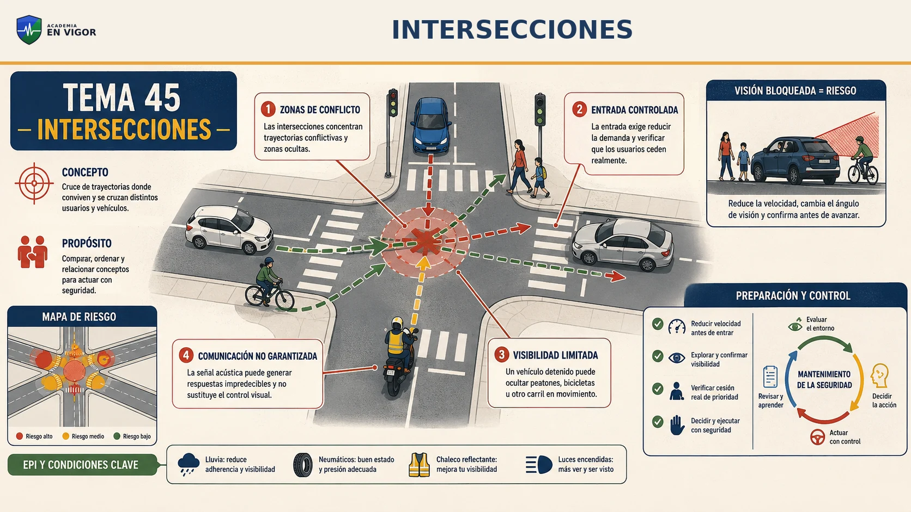

<em>Infografía: Intersecciones.</em>

<!-- FUENTE: BOE-RGC-T45 -->

## 54. Sobrecarga de tareas

**Idea de control:** Conducir, comunicar, navegar y observar tácticamente compiten por recursos atencionales.

- Conducir, comunicar, navegar y observar tácticamente compiten por recursos atencionales.
- La tripulación distribuye tareas cuando su composición lo permite.
- Los mensajes breves y priorizados reducen interferencia.
- Una comunicación puede aplazarse si compromete el control inmediato del vehículo.

<!-- VISUAL:t45-54-sobrecarga-de-tareas.webp -->

  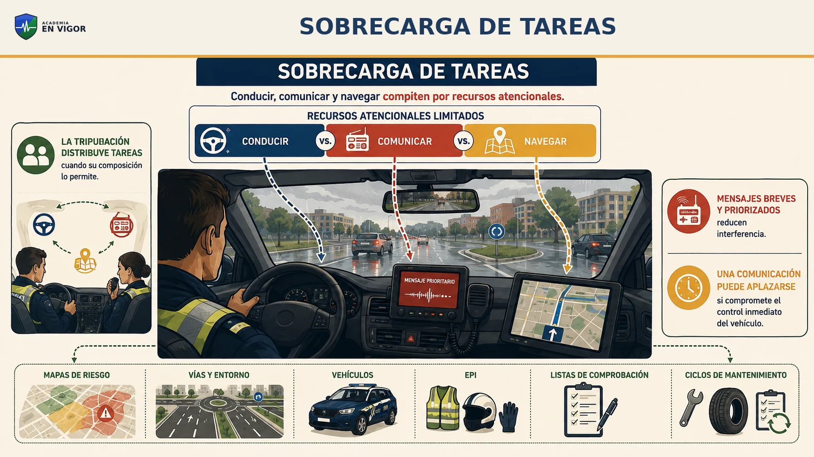

<em>Infografía: Sobrecarga de tareas.</em>

<!-- FUENTE: INSST-SVL-T45 -->

## 55. Fatiga en turnos operativos

**Idea de control:** La prolongación del servicio puede acumular fatiga aunque la misión siga siendo urgente.

- La prolongación del servicio puede acumular fatiga aunque la misión siga siendo urgente.
- La adrenalina puede enmascarar temporalmente síntomas sin restaurar capacidad.
- La planificación contempla relevo, pausas y aptitud tras intervenciones exigentes.
- El final del servicio también puede ser un periodo de riesgo por descenso de activación.

<!-- VISUAL:t45-il-55-fatiga-en-turnos-operativos.webp -->

  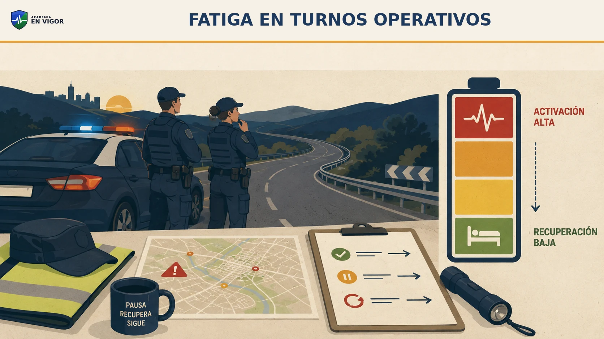

<em>Infografía: Fatiga en turnos operativos.</em>

<!-- FUENTE: DGT-FACTOR-HUMANO-T45 -->

## 56. Ergonomía con equipo policial

**Idea de control:** Chaleco, cinturón de servicio y funda pueden interferir con asiento y retención.

- Chaleco, cinturón de servicio y funda pueden interferir con asiento y retención.
- El ajuste debe evitar puntos de presión y mantener acceso seguro a mandos.
- No debe alterarse un sistema de retención de forma improvisada para ganar comodidad.
- La configuración se comprueba con el equipo realmente usado en servicio.

<!-- VISUAL:t45-56-ergonomia-con-equipo-policial.webp -->

  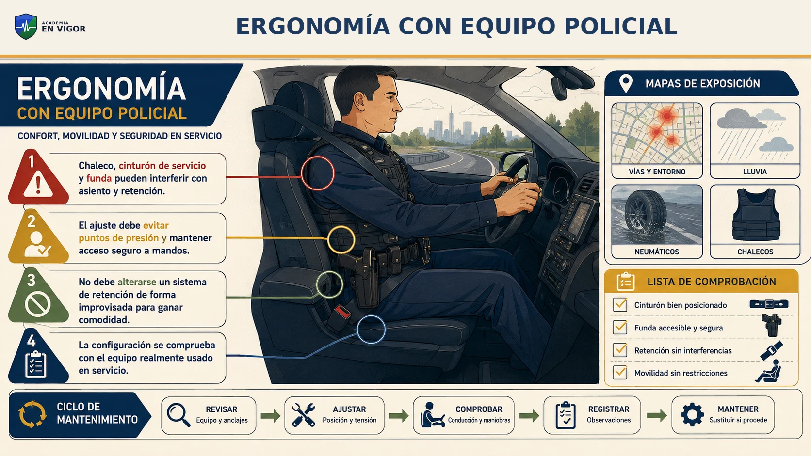

<em>Infografía: Ergonomía con equipo policial.</em>

<!-- FUENTE: INSST-SVL-T45 -->

## 57. Descenso e intervención en vía

**Idea de control:** Antes de abrir una puerta se valora tráfico, carril, visibilidad y vía de salida.

- Antes de abrir una puerta se valora tráfico, carril, visibilidad y vía de salida.
- El descenso preferente evita exponerse al flujo cuando el escenario lo permite.
- La posición del vehículo debe proteger sin crear un obstáculo más peligroso.
- La señalización y alta visibilidad complementan, pero no sustituyen, una zona segura.

<!-- VISUAL:t45-57-descenso-e-intervencion-en-via.webp -->

  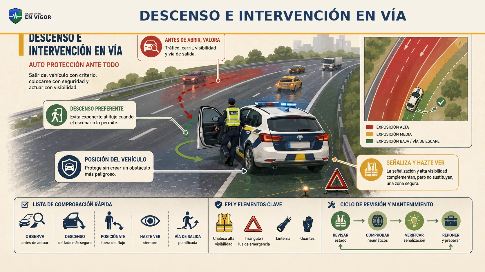

<em>Infografía: Descenso e intervención en vía.</em>

<!-- FUENTE: BOE-RGC-T45 -->

## 58. Riesgo para pasajeros y terceros

**Idea de control:** La conducción prioritaria expone a conductor, dotación, trasladados y terceros.

- La conducción prioritaria expone a conductor, dotación, trasladados y terceros.
- Las aceleraciones y frenadas afectan especialmente a personas no preparadas o con movilidad reducida.
- El material y los ocupantes deben permanecer correctamente retenidos.
- La seguridad de la misión incluye llegar sin crear nuevas víctimas.

<!-- VISUAL:t45-58-riesgo-para-pasajeros-y-terceros.webp -->

  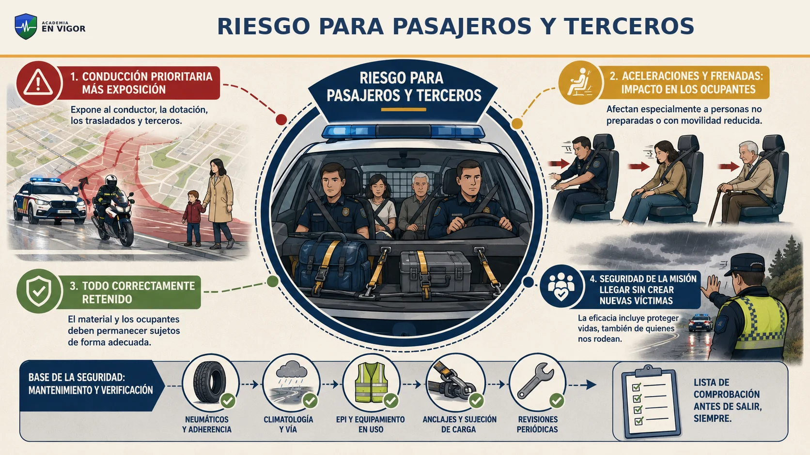

<em>Infografía: Riesgo para pasajeros y terceros.</em>

<!-- FUENTE: BOE-LSV-T45 -->

## 59. Accidente durante servicio urgente

**Idea de control:** El accidente urgente requiere atención, aseguramiento de escena y notificación por cauce.

- El accidente urgente requiere atención, aseguramiento de escena y notificación por cauce.
- La investigación examina decisión, órdenes, comunicaciones, vehículo, vía y organización.
- La existencia de una facultad reglamentaria no prueba que la maniobra fuese preventivamente adecuada.
- Las lecciones deben traducirse en medidas verificables y no solo en recordatorios genéricos.

<!-- VISUAL:t45-59-accidente-durante-servicio-urgente.webp -->

  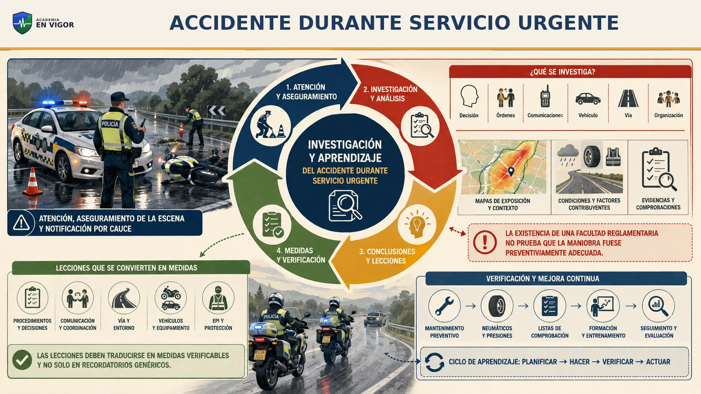

<em>Infografía: Accidente durante servicio urgente.</em>

<!-- FUENTE: BOE-LPRL-T45 -->

## 60. Criterio de llegada operativa

**Idea de control:** El objetivo es llegar con capacidad de intervenir y sin generar daños evitables.

- El objetivo es llegar con capacidad de intervenir y sin generar daños evitables.
- Una ganancia temporal pequeña puede no justificar un incremento grande de riesgo.
- Ruta, intensidad de señales y velocidad se ajustan continuamente.
- Abortar o moderar una maniobra puede ser la decisión operativa correcta.

<!-- VISUAL:t45-il-60-criterio-de-llegada-operativa.webp -->

  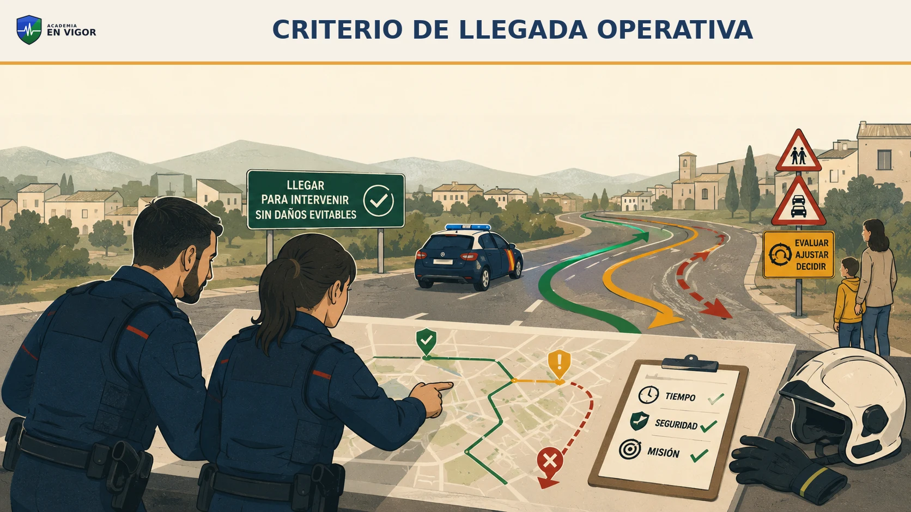

<em>Infografía: Criterio de llegada operativa.</em>

<!-- FUENTE: DGT-ESV2030-T45 -->

## 61. Definición correcta de EPI

**Idea de control:** A efectos del Real Decreto 773/1997, EPI es el equipo llevado o sujetado para proteger frente a uno o varios riesgos laborales.

- A efectos del Real Decreto 773/1997, EPI es el equipo llevado o sujetado para proteger frente a uno o varios riesgos laborales.
- La definición general también comprende complementos o accesorios destinados a esa finalidad.
- No todo elemento de seguridad relacionado con el trabajo entra en esa definición.
- La definición debe leerse junto con las exclusiones expresas del artículo 2.2.

<!-- VISUAL:t45-61-definicion-correcta-de-epi.webp -->

  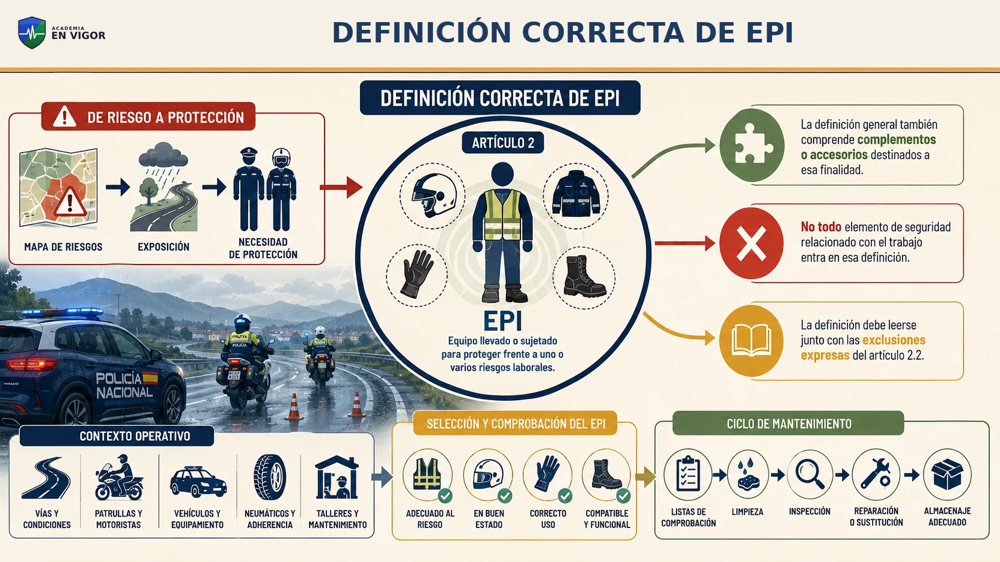

<em>Infografía: Definición correcta de EPI.</em>

<!-- FUENTE: BOE-RD773-T45 -->

## 62. Exclusiones del concepto

**Idea de control:** La ropa de trabajo corriente sin función protectora específica no es EPI.

- La ropa de trabajo corriente sin función protectora específica no es EPI.
- El artículo 2.2 excluye expresamente los equipos de protección individual de policías del concepto definido por ese real decreto.
- El mismo apartado excluye los equipos de protección individual de los medios de transporte por carretera.
- La exclusión del Real Decreto 773/1997 no significa ausencia de protección: la Policía Nacional tiene régimen preventivo específico.

<!-- VISUAL:t45-62-exclusiones-del-concepto.webp -->

  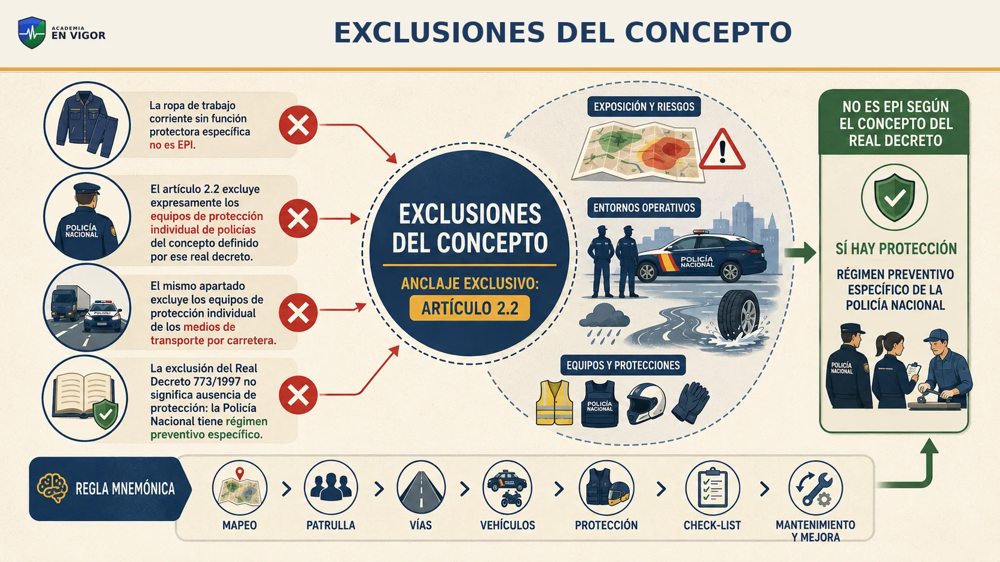

<em>Infografía: Exclusiones del concepto.</em>

<!-- FUENTE: BOE-RD773-T45 -->

## 63. Jerarquía antes de la protección individual

**Idea de control:** El régimen policial prioriza la protección colectiva sobre la individual.

- El régimen policial prioriza la protección colectiva sobre la individual.
- La protección individual se integra después de evitar, evaluar y combatir riesgos en origen.
- Entregar un chaleco no corrige por sí solo una posición insegura en la calzada.
- La selección parte del riesgo residual después de otras medidas.

<!-- VISUAL:t45-63-jerarquia-antes-de-la-proteccion-individual.webp -->

  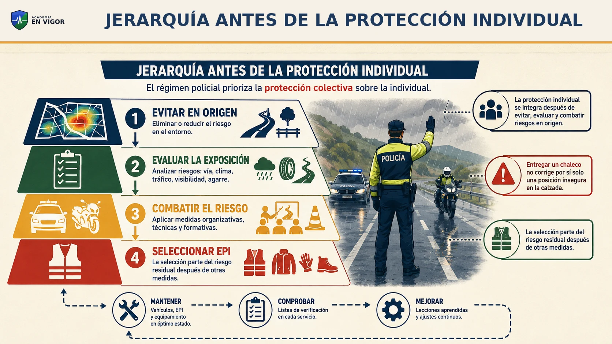

<em>Infografía: Jerarquía antes de la protección individual.</em>

<!-- FUENTE: BOE-RD2-2006-T45 -->

## 64. Evaluación y elección del equipo policial

**Idea de control:** La Administración debe elegir medios adecuados a la tarea y a la seguridad de quienes los utilizan.

- La Administración debe elegir medios adecuados a la tarea y a la seguridad de quienes los utilizan.
- La normativa específica y las recomendaciones técnico-científicas aplicables completan la selección.
- La elección debe responder al riesgo, condiciones de uso y características de la persona usuaria.
- La talla, el ajuste y la ergonomía condicionan la eficacia real del equipo.

<!-- VISUAL:t45-64-evaluacion-y-eleccion-del-equipo-policial.webp -->

  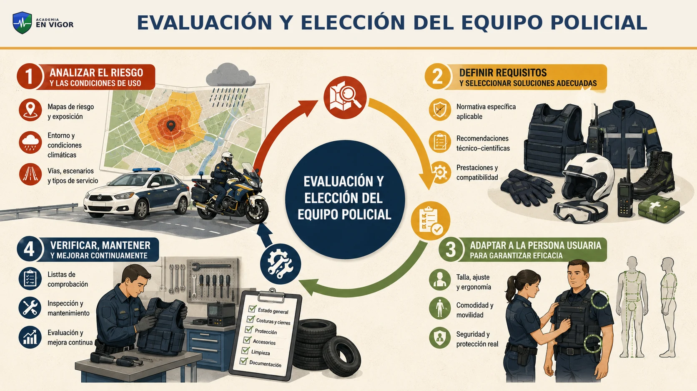

<em>Infografía: Evaluación y elección del equipo policial.</em>

<!-- FUENTE: BOE-RD2-2006-T45 -->

## 65. Compatibilidad del equipamiento

**Idea de control:** La guía del INSST aporta un criterio técnico de compatibilidad cuando se usan varios elementos protectores.

- La guía del INSST aporta un criterio técnico de compatibilidad cuando se usan varios elementos protectores.
- La compatibilidad busca conservar la eficacia de cada elemento en la configuración conjunta.
- Casco, protección auditiva, ocular y comunicaciones pueden interferir físicamente.
- En Policía, ese criterio técnico se aplica a través del régimen específico y de las instrucciones válidas que correspondan.

<!-- VISUAL:t45-il-65-compatibilidad-del-equipamiento.webp -->

  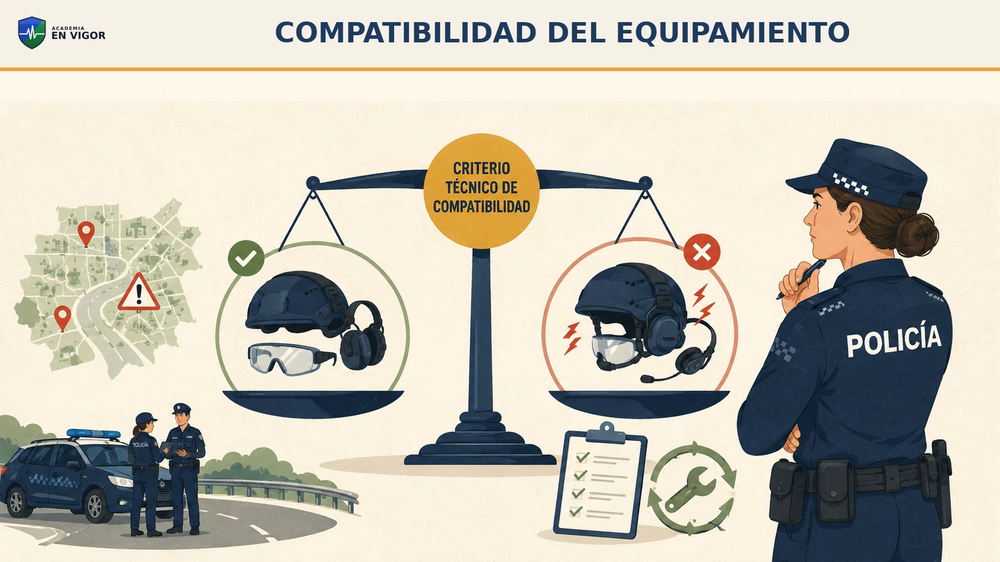

<em>Infografía: Compatibilidad del equipamiento.</em>

<!-- FUENTE: INSST-GUIA-EPI-T45 -->

## 66. Información, formación y práctica

**Idea de control:** El funcionario debe recibir información sobre riesgos y medidas de protección adoptadas.

- El funcionario debe recibir información sobre riesgos y medidas de protección adoptadas.
- La formación preventiva policial debe ser teórica y práctica, suficiente y adecuada.
- El uso del equipamiento requiere instrucciones comprensibles y entrenamiento proporcional a su complejidad.
- Ponerse el equipo una vez no acredita dominio bajo presión o baja visibilidad.

<!-- VISUAL:t45-66-informacion-formacion-y-practica.webp -->

  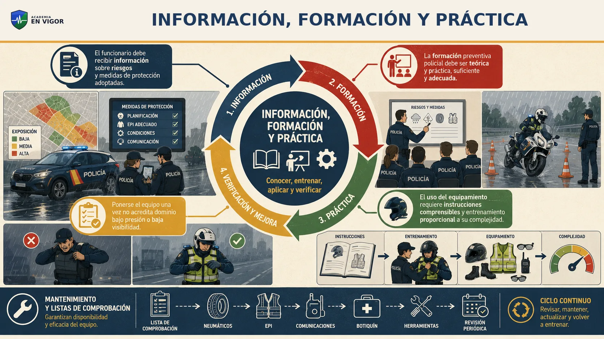

<em>Infografía: Información, formación y práctica.</em>

<!-- FUENTE: BOE-RD2-2006-T45 -->

## 67. Asignación, disponibilidad e higiene

**Idea de control:** La gestión del equipo debe asegurar disponibilidad, adecuación y estado para la tarea prevista.

- La gestión del equipo debe asegurar disponibilidad, adecuación y estado para la tarea prevista.
- Cuando un elemento se comparte, deben controlarse talla, limpieza, desinfección y trazabilidad según el riesgo.
- La inspección antes del uso evita recibir material incompleto o deteriorado.
- La asignación administrativa no sustituye la comprobación funcional.

<!-- VISUAL:t45-67-asignacion-disponibilidad-e-higiene.webp -->

  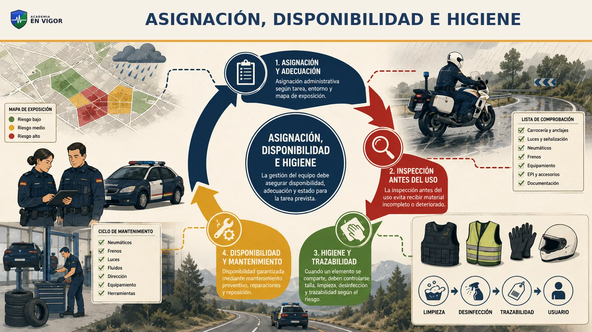

<em>Infografía: Asignación, disponibilidad e higiene.</em>

<!-- FUENTE: BOE-RD2-2006-T45 -->

## 68. Mantenimiento, limpieza y retirada

**Idea de control:** La guía del INSST aporta criterios técnicos sobre almacenamiento, limpieza, mantenimiento y reparación.

- La guía del INSST aporta criterios técnicos sobre almacenamiento, limpieza, mantenimiento y reparación.
- Un equipo deteriorado se retira cuando ya no garantiza la protección prevista.
- La inspección previa busca cortes, deformación, contaminación y piezas ausentes.
- En Policía, la conservación concreta se rige por normativa e instrucciones específicas válidas y por el fabricante.

<!-- VISUAL:t45-68-mantenimiento-limpieza-y-retirada.webp -->

  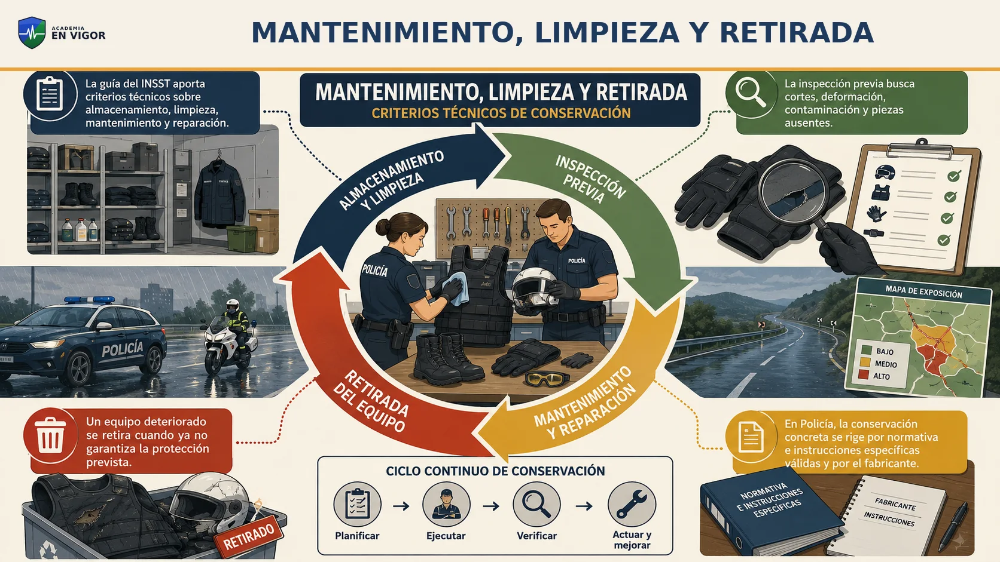

<em>Infografía: Mantenimiento, limpieza y retirada.</em>

<!-- FUENTE: INSST-GUIA-EPI-T45 -->

## 69. Alta visibilidad al regular la circulación

**Idea de control:** Los agentes que regulan la circulación deben ser fácilmente reconocibles a distancia, de día y de noche.

- Los agentes que regulan la circulación deben ser fácilmente reconocibles a distancia, de día y de noche.
- Sus prendas llamativas y elementos retrorreflectantes deben permitir distinguirlos a una distancia mínima de 150 metros.
- La regla de 150 metros se vincula a la regulación de la circulación y no se generaliza sin más a cualquier salida del vehículo.
- La alta visibilidad mejora detección, pero no crea una barrera física frente al tráfico.

<!-- VISUAL:t45-69-alta-visibilidad-al-regular-la-circulacion.webp -->

  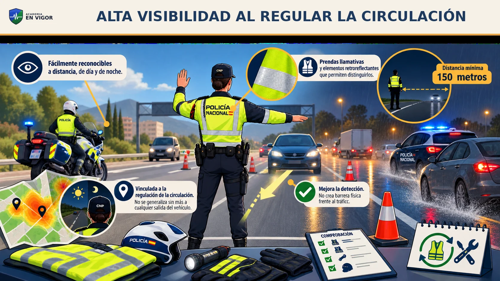

<em>Infografía: Alta visibilidad al regular la circulación.</em>

<!-- FUENTE: BOE-RGC-T45 -->

## 70. Motorista policial y protección

**Idea de control:** El equipamiento del motorista se selecciona frente a impacto, abrasión, clima y visibilidad.

- El equipamiento del motorista se selecciona frente a impacto, abrasión, clima y visibilidad.
- Casco, guantes, botas y ropa protectora cumplen funciones distintas y complementarias.
- La protección no debe impedir manejo de mandos, audición útil ni movilidad necesaria.
- El régimen policial específico determina la dotación exigible; la guía técnica ayuda a razonar su ajuste y compatibilidad.

<!-- VISUAL:t45-il-70-motorista-policial-y-proteccion.webp -->

  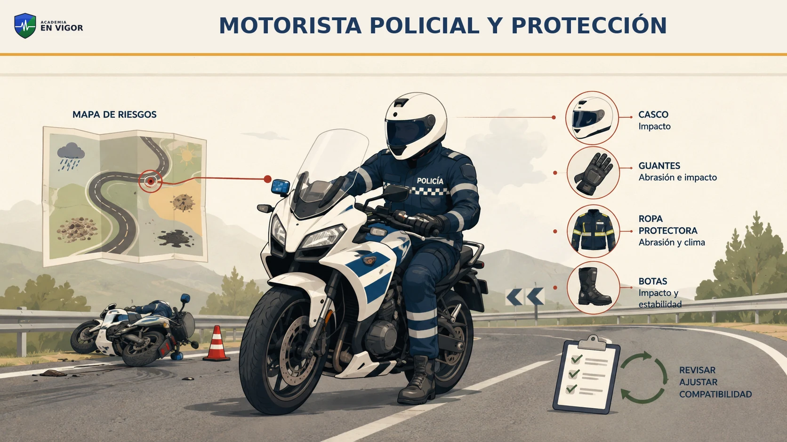

<em>Infografía: Motorista policial y protección.</em>

<!-- FUENTE: INSST-GUIA-EPI-T45 -->

## 71. Estrategia preventiva por capas

**Idea de control:** La estrategia combina reducción de exposición, organización, vehículo seguro, formación y protección.

- La estrategia combina reducción de exposición, organización, vehículo seguro, formación y protección.
- Las medidas se eligen sobre causas y no solo sobre consecuencias visibles.
- Las capas deben seguir funcionando si una de ellas falla.
- La revisión periódica comprueba eficacia y efectos no previstos.

<!-- VISUAL:t45-71-estrategia-preventiva-por-capas.webp -->

  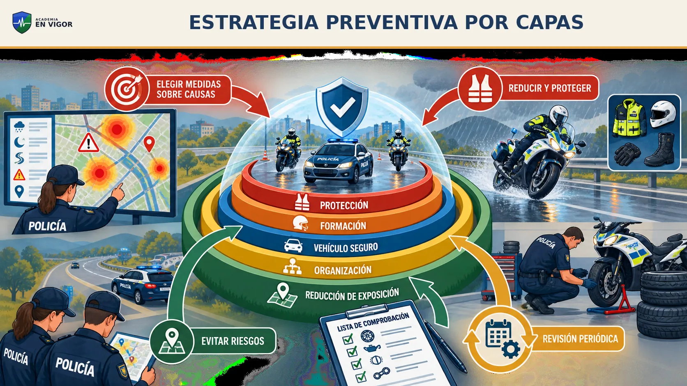

<em>Infografía: Estrategia preventiva por capas.</em>

<!-- FUENTE: INSST-SVL-T45 -->

## 72. Lista previa al servicio

**Idea de control:** La comprobación previa cubre estado exterior, neumáticos, fluidos visibles, luces, testigos y material esencial.

- La comprobación previa cubre estado exterior, neumáticos, fluidos visibles, luces, testigos y material esencial.
- Su alcance debe ser realista, enseñado y adaptado al tipo de vehículo.
- Una lista no sustituye la intervención de personal técnico.
- La anomalía crítica obliga a inmovilizar o sustituir conforme al procedimiento.

<!-- VISUAL:t45-72-lista-previa-al-servicio.webp -->

  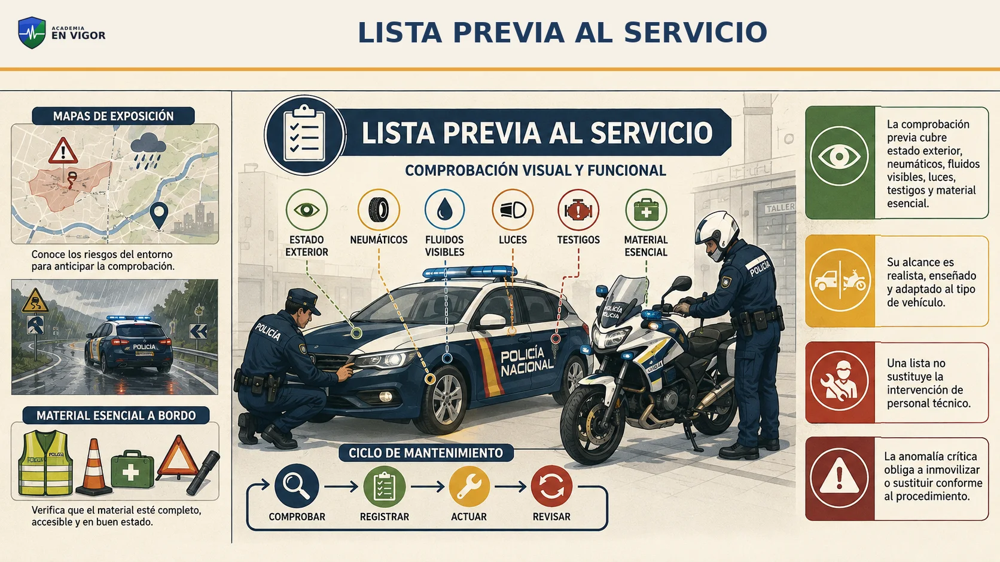

<em>Infografía: Lista previa al servicio.</em>

<!-- FUENTE: INSST-SVL-T45 -->

## 73. Mantenimiento preventivo

**Idea de control:** El mantenimiento preventivo se programa antes del fallo según uso, tiempo y especificaciones.

- El mantenimiento preventivo se programa antes del fallo según uso, tiempo y especificaciones.
- Aceites, filtros, correas, frenos y neumáticos no comparten un intervalo universal.
- El servicio exigente puede justificar controles más frecuentes conforme a criterio técnico.
- Las operaciones deben quedar registradas para conocer estado e historial.

<!-- VISUAL:t45-73-mantenimiento-preventivo.webp -->

  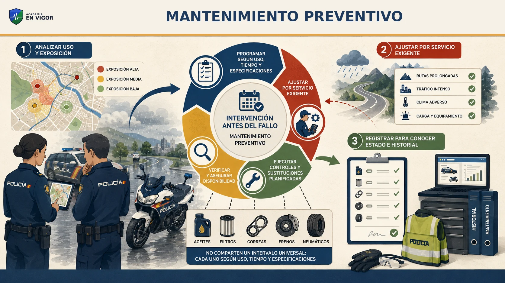

<em>Infografía: Mantenimiento preventivo.</em>

<!-- FUENTE: BOE-ITV-T45 -->

## 74. Mantenimiento predictivo y por condición

**Idea de control:** El mantenimiento por condición usa mediciones, avisos o tendencias para anticipar degradación.

- El mantenimiento por condición usa mediciones, avisos o tendencias para anticipar degradación.
- Una alerta predictiva necesita interpretación y umbrales definidos.
- La ITV no debe llamarse mantenimiento predictivo porque su función jurídica es inspeccionar.
- Los datos complementan la inspección y no sustituyen observación ni diagnóstico.

<!-- VISUAL:t45-74-mantenimiento-predictivo-y-por-condicion.webp -->

  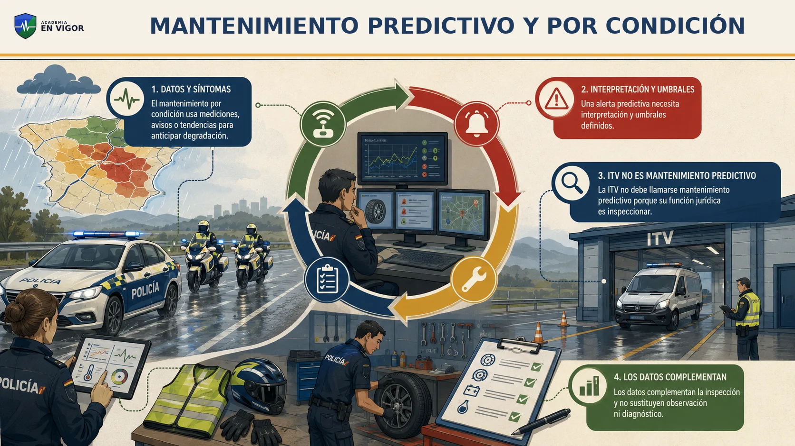

<em>Infografía: Mantenimiento predictivo y por condición.</em>

<!-- FUENTE: INSST-SVL-T45 -->

## 75. Mantenimiento correctivo

**Idea de control:** El correctivo restaura una función después de detectarse un defecto o fallo.

- El correctivo restaura una función después de detectarse un defecto o fallo.
- La prioridad es definir si el vehículo puede circular con seguridad hasta reparación.
- Reparar una consecuencia sin causa raíz favorece recurrencia.
- Tras la reparación se verifica la función y, cuando proceda, la calibración.

<!-- VISUAL:t45-il-75-mantenimiento-correctivo.webp -->

  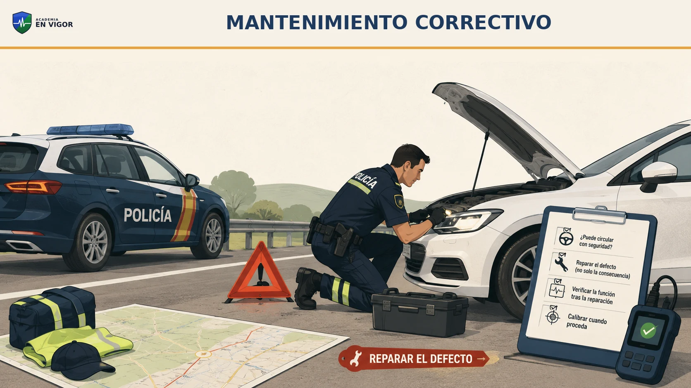

<em>Infografía: Mantenimiento correctivo.</em>

<!-- FUENTE: BOE-ITV-T45 -->

## 76. Gestión de averías e inmovilización

**Idea de control:** Un fallo se clasifica por efecto potencial, probabilidad y posibilidad de control.

- Un fallo se clasifica por efecto potencial, probabilidad y posibilidad de control.
- La presión operativa no convierte un vehículo inseguro en apto.
- La inmovilización debe acompañarse de señalización, custodia y alternativa de servicio.
- La comunicación precisa evita que otra unidad reutilice el vehículo defectuoso.

<!-- VISUAL:t45-76-gestion-de-averias-e-inmovilizacion.webp -->

  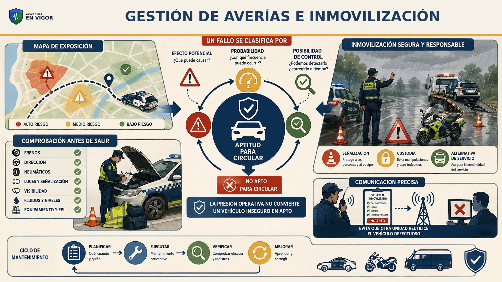

<em>Infografía: Gestión de averías e inmovilización.</em>

<!-- FUENTE: BOE-LSV-T45 -->

## 77. Registro y trazabilidad

**Idea de control:** El registro relaciona vehículo, fecha, kilometraje, defecto, intervención y verificación.

- El registro relaciona vehículo, fecha, kilometraje, defecto, intervención y verificación.
- La trazabilidad permite detectar recurrencias y planificar renovaciones.
- Los datos deben ser completos y comparables sin convertirse en burocracia vacía.
- Una incidencia cerrada exige evidencia de corrección o decisión documentada.

<!-- VISUAL:t45-77-registro-y-trazabilidad.webp -->

  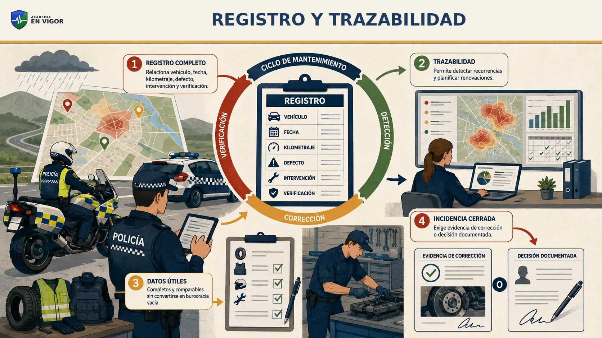

<em>Infografía: Registro y trazabilidad.</em>

<!-- FUENTE: BOE-RD2-2006-T45 -->

## 78. Neumáticos y presión operativa

**Idea de control:** La presión se ajusta a indicaciones del fabricante y a la carga prevista.

- La presión se ajusta a indicaciones del fabricante y a la carga prevista.
- Daños laterales, deformaciones o desgaste irregular requieren valoración.
- La temperatura modifica la presión y debe considerarse al medir.
- Ejes y neumáticos deben mantener compatibilidad y especificaciones autorizadas.

<!-- VISUAL:t45-78-neumaticos-y-presion-operativa.webp -->

  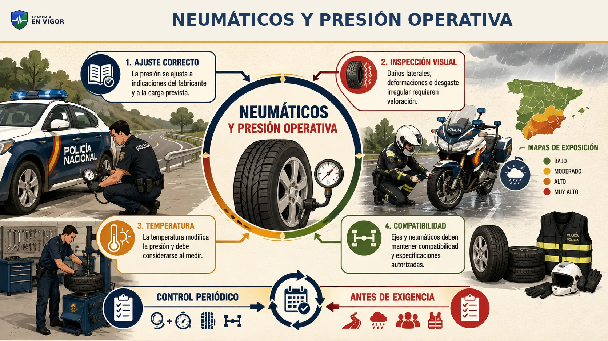

<em>Infografía: Neumáticos y presión operativa.</em>

<!-- FUENTE: BOE-RGV-T45 -->

## 79. Fluidos, batería y sistemas auxiliares

**Idea de control:** Los niveles y fugas se comprueban sin abrir sistemas peligrosos en caliente.

- Los niveles y fugas se comprueban sin abrir sistemas peligrosos en caliente.
- Una batería degradada afecta arranque y sistemas eléctricos de emergencia.
- Los equipos auxiliares añaden consumo y deben integrarse técnicamente.
- Una reparación eléctrica improvisada puede causar fallo o incendio.

<!-- VISUAL:t45-79-fluidos-bateria-y-sistemas-auxiliares.webp -->

  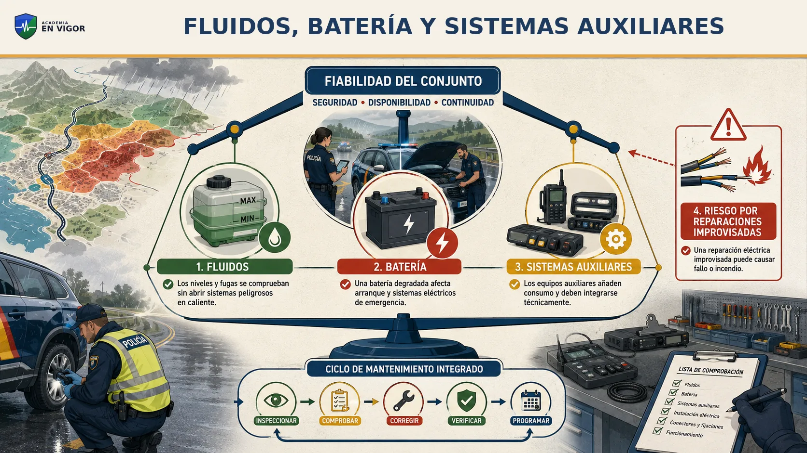

<em>Infografía: Fluidos, batería y sistemas auxiliares.</em>

<!-- FUENTE: BOE-ITV-T45 -->

## 80. Cierre del ciclo preventivo

**Idea de control:** El ciclo preventivo identifica, evalúa, planifica, ejecuta, comprueba y revisa.

- El ciclo preventivo identifica, evalúa, planifica, ejecuta, comprueba y revisa.
- Los indicadores combinan exposición, incidentes, defectos, cumplimiento y resultados.
- Los casi accidentes aportan señales antes de un daño grave.
- La mejora requiere corregir el sistema y verificar que la medida funciona en servicio real.

<!-- VISUAL:t45-il-80-cierre-del-ciclo-preventivo.webp -->

  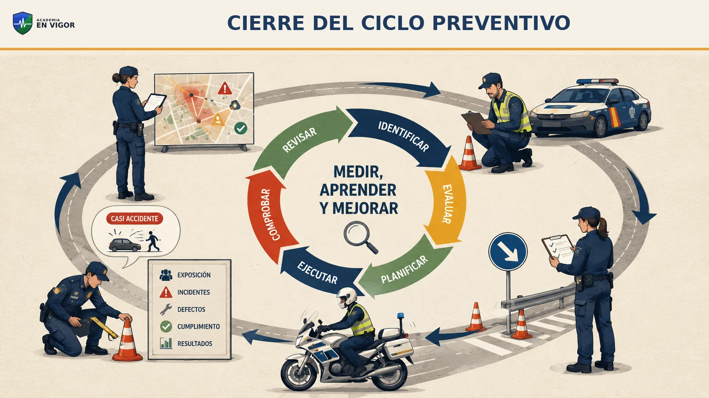

<em>Infografía: Cierre del ciclo preventivo.</em>

<!-- FUENTE: BOE-LPRL-T45 -->

# Hablemos claro

:::hablemos-claro
Este tema exige separar momento, función y límite. Activa no significa electrónica; pasiva no significa opcional; ADAS no equivale a autonomía; ABS no crea adherencia; airbag no sustituye cinturón; y una cifra de efectividad no es una ley universal.
:::

# En la calle

:::en-la-calle
En servicio, revisar el vehículo, distribuir tareas, anticipar reacciones y conservar espacio permite llegar con capacidad operativa. En traslado, la seguridad incluye dignidad, habitabilidad, retención, vigilancia y evacuación.
:::

# Lo que cae

:::lo-que-cae
Prioriza activa-pasiva-terciaria; energía y adherencia; cinturón-pretensor-limitador-airbag; ABS-ESC-TCS; FCW-AEB; LDW-LKA; calendario 2022-2024-2026; moto; artículo 119; y anexos I-II de la Orden INT/2573/2015.
:::

# Ha caído

:::ha-caido
Se han localizado 10 referencias históricas del Tema 45. Permanecen ocultas y en cuarentena porque no existe plantilla oficial final verificable en el repositorio.
:::

## Fuentes legales, institucionales y primarias

- `CONVOCATORIA-PN-2026-T45`
- `BOE-LPRL-T45`
- `BOE-RD2-2006-T45`
- `BOE-RSP-T45`
- `BOE-LGSS-T45`
- `INSST-SVL-T45`
- `INSST-NTP1090-T45`
- `INSST-NTP1091-T45`
- `INSST-ALT2024-T45`
- `DGT-ESV2030-T45`
- `BOE-LSV-T45`
- `BOE-RGC-T45`
- `BOE-RGV-T45`
- `BOE-ITV-T45`
- `BOE-RD773-T45`
- `INSST-GUIA-EPI-T45`
- `DGT-FACTOR-HUMANO-T45`

---

*Academia En Vigor · El temario que nunca duerme · Tema 45 · v1.0.0 · Documento interno no publicado.*
